# Architecture Documentation — Easy English v2

> **Source of truth:** Derived from the codebase, configuration files, and infrastructure setup. When anything here conflicts with the code, the code wins. Sections marked **[Assumption]** are inferred from code. Sections marked **[Needs Verification]** cannot be determined from code alone.

---

## Table of Contents

1. [Overview](#1-overview)
2. [Stakeholders](#2-stakeholders)
3. [Constraints & Assumptions](#3-constraints--assumptions)
4. [Architecture Summary](#4-architecture-summary)
5. [C4 Context](#5-c4-context)
6. [C4 Container](#6-c4-container)
7. [C4 Component](#7-c4-component)
8. [Runtime / Key Flows](#8-runtime--key-flows)
9. [Data Flow & State](#9-data-flow--state)
10. [Deployment & Environment](#10-deployment--environment)
11. [Integration & External Dependencies](#11-integration--external-dependencies)
12. [Security, Reliability & Observability](#12-security-reliability--observability)
13. [Guidelines for Developers](#13-guidelines-for-developers)
14. [Open Questions / Unknowns](#14-open-questions--unknowns)

---

## 1. Overview

**What it does:** Easy English v2 is a multi-tenant English vocabulary learning platform. Users look up English words, add them to a personal learning list, and review them via spaced repetition sessions (FSRS algorithm). Flash cards provide an alternative review mode. Topics allow users to group and study word sets.

**Business goals:**
- Help individual users build English vocabulary effectively via spaced repetition
- Support multi-tenant isolation so the platform can eventually serve organizations (schools, companies)
- Provide a clean dictionary lookup backed by word senses, examples, and pronunciations

**Technical goals:**
- Clean, maintainable backend via DDD + CQRS
- Scalable multi-tenant data model
- Decoupled frontend via API-first design

**System scope:**
- In scope: user auth, workspace setup, dictionary lookup, learning progress tracking, study sessions, flashcards, topic management
- Out of scope: payment, organization admin panel, real-time collaboration, mobile apps

**Main components:**

| Component | Role |
|---|---|
| `server/` | NestJS REST API — all business logic |
| `client/` | React SPA — user-facing UI |
| PostgreSQL | Single primary database |
| AzVocab API | External (unofficial) dictionary data source |

---

## 2. Stakeholders

| Group | Interest |
|---|---|
| End users (learners) | Fast dictionary lookup, reliable spaced repetition, good UX |
| Platform team (developers) | Clean architecture, low maintenance burden, easy feature addition |
| Future org admins | [Needs Verification] Manage members and billing within a tenant |
| Ops / infra | Deployment simplicity, observability, database backups |

---

## 3. Constraints & Assumptions

### Technical constraints
- PostgreSQL is the only data store (no Redis, no message queue currently)
- AzVocab is an **unofficial API** (reverse-engineered). It may break without notice — no SLA.
- No CI/CD pipeline configured. All deployments are manual.
- No server Dockerfile yet. Client has Dockerfile (Node build → Nginx).
- `@nestjs/schedule` is installed but **no scheduled tasks are implemented**.

### Business constraints
- Multi-tenancy: currently 1 registration = 1 tenant (isolated). Architecture is designed to support multiple users per tenant in the future (e.g., school accounts).
- No payment or subscription system implemented.

### Assumptions (inferred from code)
- **[Assumption]** AzVocab is the only dictionary provider. The `ILookupProvider` interface allows swapping providers, but only `AzVocabLookupProvider` is registered.
- **[Assumption]** Workspaces are per-user, per-tenant. A user can have multiple workspaces (different languages or goals).
- **[Assumption]** The `argon2` npm package is installed but unused — bcrypt is the active password hasher.
- **[Assumption]** In-memory NestJS `CacheModule` (no Redis). Cache is lost on server restart.

---

## 4. Architecture Summary

**Pattern: Modular Monolith (server) + SPA (client)**

The backend is a single NestJS process with well-bounded domain modules. All modules share one PostgreSQL database and communicate internally via `@nestjs/cqrs` (command/query bus) and `@nestjs/event-emitter` (domain events). There is no inter-service HTTP or message queue — this is **not** microservices.

**Why modular monolith:**
- All domain logic lives in one `AppModule`
- Modules share a single DB connection (`MikroORM EntityManager`)
- Cross-module communication is in-process (`EventEmitter`, CQRS bus)
- No network boundary between modules

**Domain modules:**

| Module | Subdomain | Responsibility |
|---|---|---|
| `auth` | Auth | Registration, login, JWT tokens, sessions |
| `workspace` | Workspace | Workspace CRUD, user learning preferences |
| `dictionary` | Dictionary | Word lookup, enrichment, persistence |
| `learning/progress` | Learning | Track per-word-sense learning progress (FSRS) |
| `learning/study` | Learning | Study sessions, reviews, statistics |
| `learning/topic` | Learning | Topic (word list) management |
| `flashcard` | Flashcard | Flashcard CRUD, spaced repetition reviews |

**High-level data flow:**

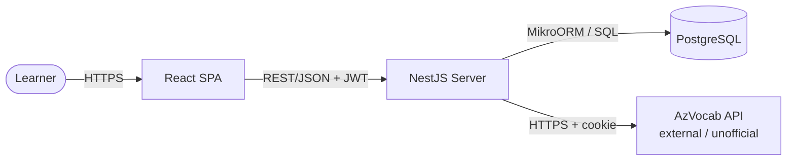

---

## 5. C4 Context

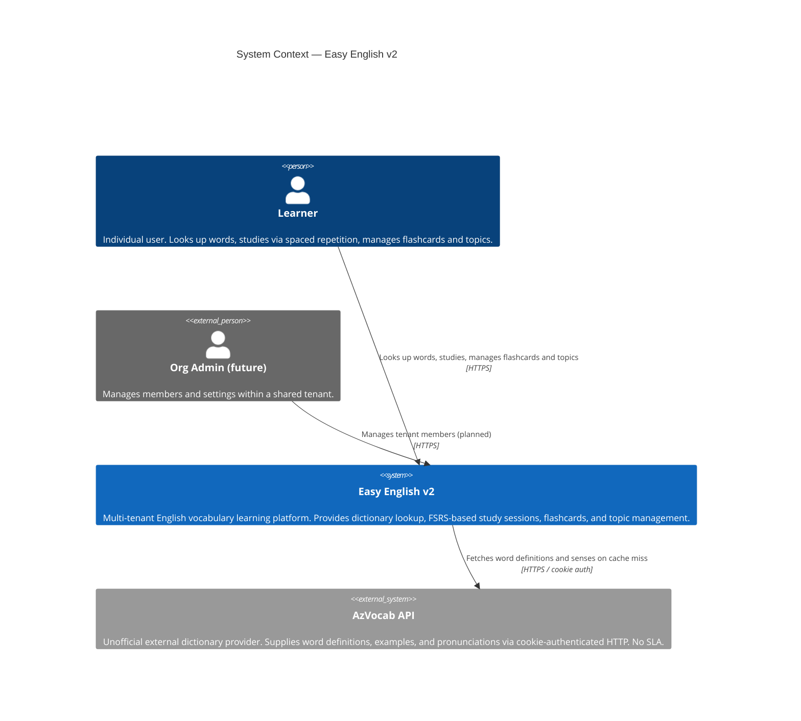

---

## 6. System Context Diagram

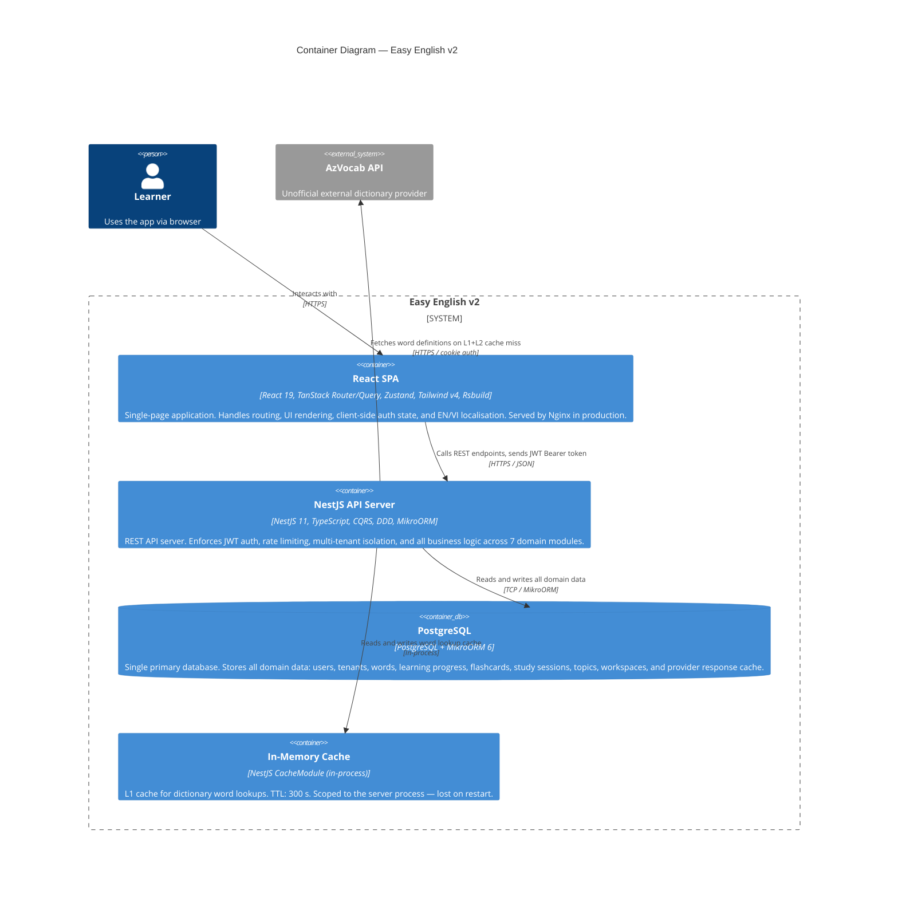

**Container communication summary:**

| From | To | Protocol |
|---|---|---|
| React SPA | NestJS Server | HTTPS REST/JSON — JWT Bearer header + refresh cookie |
| NestJS Server | PostgreSQL | TCP via MikroORM driver |
| NestJS Server | AzVocab API | HTTPS with cookie-based auth |
| NestJS Server | In-Memory Cache | In-process function call |

---

## 7. C4 Component

### 7.1 NestJS Server — Component Overview

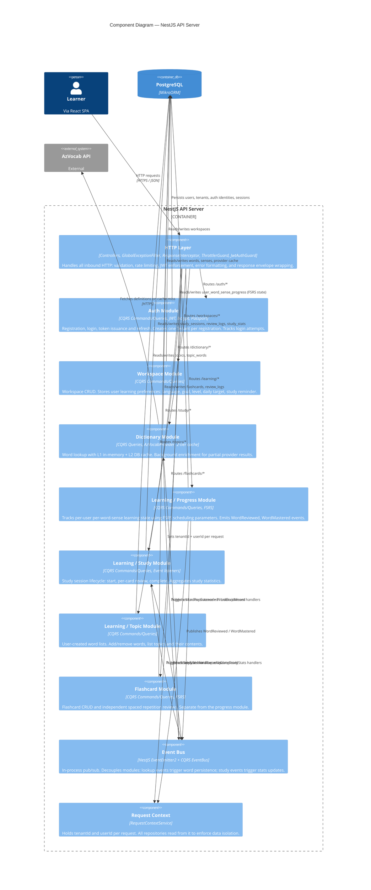

### 7.2 Standard Module Folder Structure

Every domain module follows the same layered layout:

```
modules/{name}/
├── controllers/          HTTP entrypoints (DTOs in, DTOs out)
├── application/
│   ├── commands/         Write operations — *.command.ts + *.handler.ts
│   ├── queries/          Read operations  — *.query.ts  + *.handler.ts
│   ├── events/           Domain event handlers (cross-module reactions)
│   └── ports/            Application-layer abstractions (interfaces)
├── domain/
│   ├── entities/         Domain entities & aggregates
│   ├── value-objects/    Immutable value objects
│   ├── events/           Domain event definitions
│   ├── exceptions/       Domain-specific errors
│   └── repositories/     Repository interfaces (ports)
├── infrastructure/
│   ├── persistence/      ORM entities (*.orm-entity.ts)
│   ├── repositories/     Repository implementations (MikroORM)
│   ├── services/         Infrastructure services (hashers, HTTP clients)
│   └── providers/        External provider adapters
└── dto/
    ├── requests/         Input DTOs (validated via class-validator)
    └── responses/        Output DTOs
```

### 7.3 Client — Module Structure

```mermaid
flowchart TD
    src[client/src/]

    src --> core[core/]
    src --> modules[modules/]
    src --> shared[shared/]

    core --> coreApi[api/\nAxios instance · interceptors\ntoken refresh · error types]
    core --> coreRoute[routing/\nTanStack Router setup\nroute tree gen]

    modules --> auth[auth/\nlogin · register screens\nauth API service]
    modules --> workspace[workspace/\ncreation · settings]
    modules --> dict[dictionary/\nword search\nword sense detail]
    modules --> learning[learning/\nmy learning list\nstudy session]
    modules --> flashcard[flashcard/\nlist · study mode · stats]
    modules --> topic[topic/\nlist · detail]
    modules --> progress[progress/\noverview]
    modules --> settings[settings/\nuser settings]
    modules --> dashboard[dashboard/\nmain dashboard]
    modules --> shell[shell/\nauthenticated layout\nunauthenticated layout\nfullscreen layout]

    shared --> stores[stores/\nauth-store · appearance-store\nZustand + localStorage]
    shared --> ui[ui/\nds-* components\nshadcn/* · design tokens]
    shared --> hooks[hooks/\nshared custom hooks]
```

---

## 8. Runtime / Key Flows

### 8.1 Registration + Tenant Creation

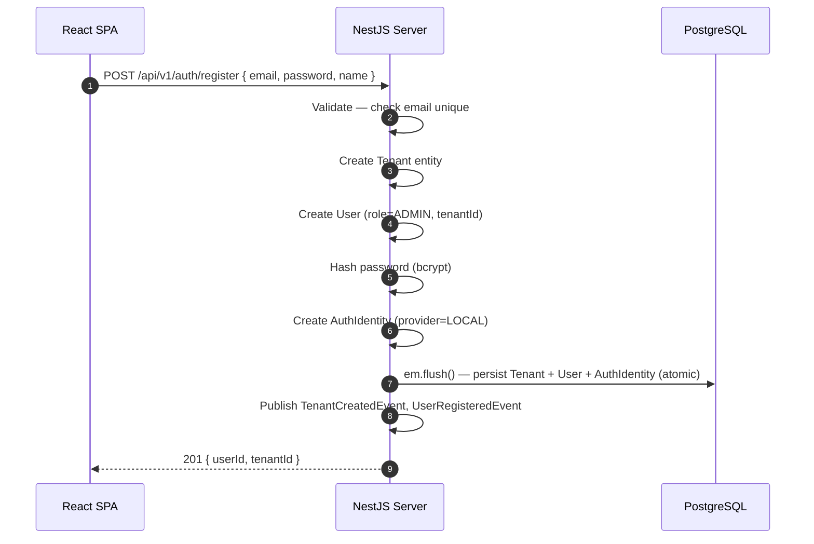

### 8.2 Login + JWT Issuance

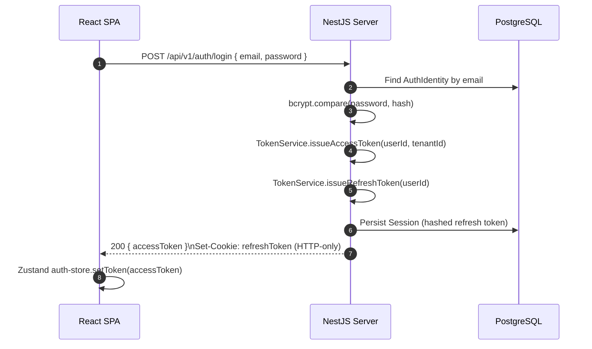

### 8.3 Token Refresh (Axios interceptor)

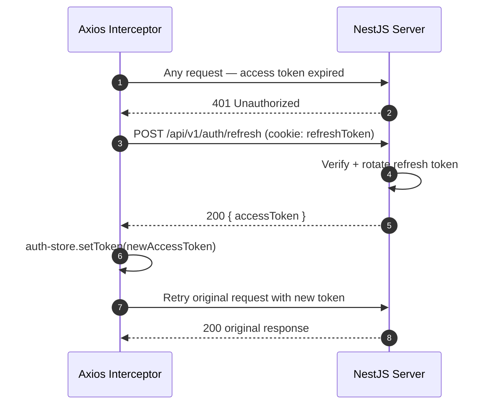

### 8.4 Dictionary Lookup (with 2-tier cache)

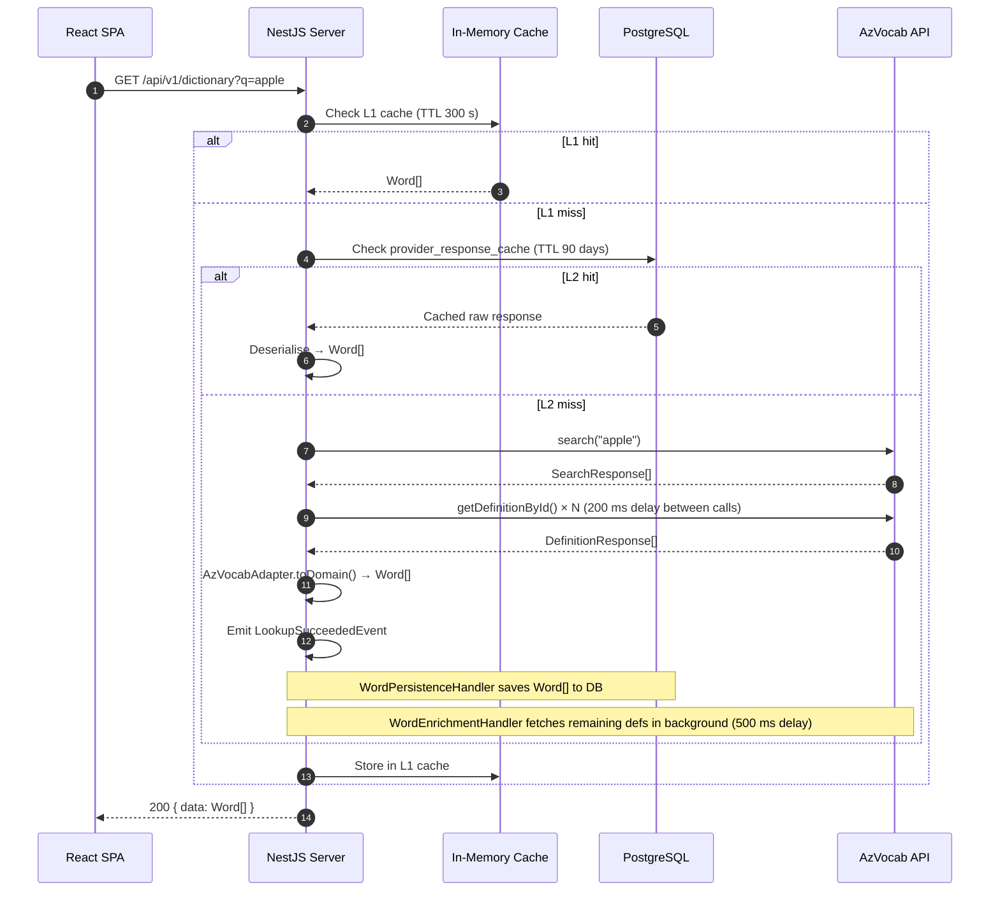

### 8.5 Study Session Flow

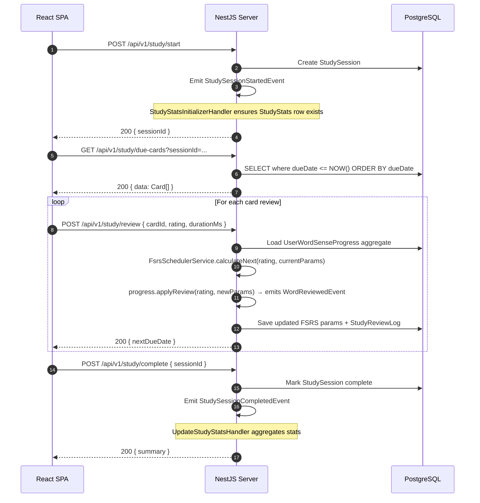

---

## 9. Data Flow & State

### Source of Truth

| Data | Table(s) | Notes |
|---|---|---|
| User identity & auth | `users`, `auth_identities`, `sessions` | |
| Tenant | `tenants` | 1 per registration currently |
| Word definitions | `words`, `word_senses`, `word_examples`, `word_pronunciations` | Populated from AzVocab |
| Raw provider responses | `provider_response_cache` | 90-day TTL (404 cached 24 h) |
| Learning progress | `user_word_sense_progress` | FSRS params per word-sense per user |
| Study sessions | `study_sessions`, `study_review_logs`, `study_stats` | |
| Flashcards | `flashcards`, `review_logs` | Independent from progress module |
| Topics | `topics`, `topic_words` | |
| Workspaces | `workspaces` | Per-user per-tenant |
| Auth state (client) | Zustand `auth-store` → localStorage | Access token + user info |
| UI state (client) | Zustand `appearance-store` + TanStack Query cache | Ephemeral |

### Dictionary Cache Layers

```mermaid
flowchart TD
    REQ([Request: lookup 'apple']) --> L1{L1: In-Memory Cache\nTTL 300 s}
    L1 -->|hit| RESP([Return Word[]])
    L1 -->|miss| L2{L2: provider_response_cache\nPostgreSQL · TTL 90 days}
    L2 -->|hit| DESER[Deserialise raw JSON → Word[]]
    DESER --> RESP
    L2 -->|miss| L3{L3: words + word_senses\nPostgreSQL}
    L3 -->|hit| RESP
    L3 -->|miss| AZ[AzVocab HTTP API\nexternal · unofficial]
    AZ -->|Word[]| PERSIST[WordPersistenceHandler\nsave to PostgreSQL]
    PERSIST --> RESP
    AZ -->|partial data| ENRICH[WordEnrichmentHandler\nbackground fetch remaining defs]
```

### FSRS State Machine (per word-sense per user)

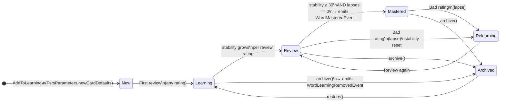

---

## 10. Deployment & Environment

### Current State

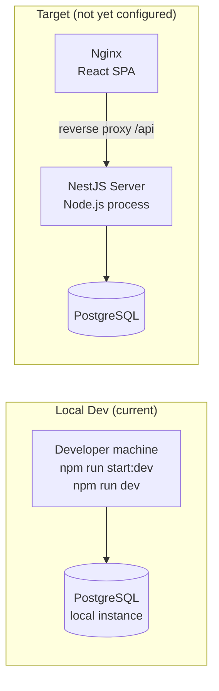

- **Not deployed.** Development is local only.
- Client has a Dockerfile (multi-stage: Node 20 build → Nginx Alpine SPA hosting).
- Server has **no Dockerfile** yet.
- No CI/CD pipeline configured (`.github/workflows/` is empty).

### Environment Variables

**Server (key vars):**

| Variable | Purpose |
|---|---|
| `DATABASE_URL` | PostgreSQL connection string |
| `JWT_SECRET` | JWT signing secret |
| `JWT_REFRESH_SECRET` | Refresh token signing secret |
| `AZVOCAB_API_URL` | AzVocab base URL |
| `AZVOCAB_COOKIE` | Cookie for AzVocab auth |
| `AZVOCAB_BUILD_ID` | Build ID parameter for AzVocab requests |
| `CORS_ORIGINS` | Allowed CORS origins |
| `PORT` | Server port |
| `NODE_ENV` | `development` or `production` |
| `PROVIDER_CACHE_TTL_DAYS` | DB cache TTL for provider responses (default: 90) |
| `MEMORY_CACHE_TTL_SECONDS` | In-memory cache TTL (default: 300) |

**Client (key vars):**

| Variable | Purpose |
|---|---|
| `RSBUILD_API_URL` | Backend API base URL |

---

## 11. Integration & External Dependencies

### AzVocab API

| Attribute | Value |
|---|---|
| Type | **Unofficial / reverse-engineered** |
| Auth | HTTP cookie (`AZVOCAB_COOKIE`) |
| Rate limiting | Manual delay: 200 ms between immediate fetches, 500 ms for background enrichment |
| Resilience | Returns `ServiceUnavailableException` (503) on failure; **no retry logic** |
| Risk | **HIGH** — no SLA, no official support, can break without notice |
| Mitigation | Two-tier cache (in-memory + PostgreSQL 90 days) reduces live call volume |

**No other external integrations exist.** No email service, payment provider, push notifications, analytics, or OAuth provider.

---

## 12. Security, Reliability & Observability

### Authentication & Authorization

```mermaid
flowchart TD
    REQ([Incoming request]) --> GUARD{JwtAuthGuard\nAPP_GUARD}
    GUARD -->|@Public decorator| PASS([Route handler])
    GUARD -->|valid JWT| INJECT[Inject user into request\nRequestContextService sets tenantId]
    INJECT --> PASS
    GUARD -->|invalid / missing| ERR([401 Unauthorized])
```

- **AuthN:** JWT access tokens (short-lived) + refresh tokens (HTTP-only cookie, longer-lived)
- **AuthZ:** Role stored on `User` entity (`ADMIN` / `MEMBER`). Guard enforcement: **[Needs Verification]** — role-based guards are not yet visible in controllers.
- **Multi-tenant isolation:** Every query must be scoped by `tenantId`. `RequestContextService` tracks the current tenant per request. **[Assumption]** ORM queries always include `tenantId` filter — this is critical and should be audited.
- **Password hashing:** bcrypt via `BcryptPasswordHasherService`
- **Login attempt tracking:** `LoginAttemptTrackerOrmEntity` tracks failed logins (lockout logic: **[Needs Verification]**)
- **Rate limiting:** Global `ThrottlerGuard` (TTL/limit configurable via `appConfig`)
- **Input validation:** Global `ValidationPipe` with `whitelist: true, transform: true`

### Error Handling

- `GlobalExceptionFilter` catches all unhandled exceptions → standardized error envelope
- Domain errors (`DomainException`, `ApplicationException`) are separate from infrastructure errors
- `neverthrow` `Result<T, E>` used in some domain operations for explicit error paths
- AzVocab errors surface as `ServiceUnavailableException` (503)

### Reliability Risks

| Risk | Severity | Status |
|---|---|---|
| AzVocab API breaks | HIGH | Partially mitigated by caching |
| In-memory cache lost on restart | LOW | PostgreSQL cache is fallback |
| No retry / circuit-breaker on AzVocab | MEDIUM | Open risk |
| No CI/CD — manual deploys | MEDIUM | Accepted for now |
| `tenantId` filter missing on a query | CRITICAL | Needs systematic audit |

### Observability

- **Logging:** NestJS `Logger` used throughout (not a structured logger like Pino/Winston)
- **Tracing:** None
- **Metrics:** None
- **Correlation IDs:** `correlationId` present in response envelope — **[Needs Verification]** whether it is set server-side per request
- **Swagger:** Available at `{domain}/api/docs` in all environments

---

## 13. Guidelines for Developers

### Adding a New Feature

1. **Identify the domain.** Existing module or new one?
2. **If new module:** Follow the folder structure in §7.2. Register in `AppModule`.
3. **Write the domain entity first.** Define entity, value objects, and domain events before any infrastructure.
4. **Add command or query handler.** Wire it in the module's `providers` array.
5. **Add the controller action.** Input DTO → Command/Query → Response DTO. No business logic in controllers.
6. **Add ORM entity and repository.** Separate from domain entity. Use a mapper.
7. **Write domain events** for state changes that other modules should react to.

### Folder & File Conventions

| Pattern | Convention |
|---|---|
| Domain entity | `*.entity.ts` |
| ORM entity | `*.orm-entity.ts` |
| Command | `*.command.ts` + `*.handler.ts` |
| Query | `*.query.ts` + `*.handler.ts` |
| Domain event | `*.event.ts` |
| Repository interface | `*.repository.interface.ts` |
| Repository implementation | `*.repository.ts` |
| DTO (request) | `*.request.dto.ts` |
| DTO (response) | `*.response.dto.ts` |

### Naming Conventions

- Files: `kebab-case`
- Classes: `PascalCase`
- Variables/functions: `camelCase`
- Constants: `UPPER_SNAKE_CASE`
- Booleans: `isX`, `hasX`, `canX`, `shouldX`
- Custom hooks (client): `useX`

### Cross-Module Communication Rules

- **Commands/Queries:** Use `CommandBus` / `QueryBus` within a module or for well-defined cross-module calls.
- **Domain events:** Use `EventBus` or `EventEmitter2` for side effects that cross module boundaries.
- **Never:** Import a repository or service from another module directly. Use events or application ports.

### Client Conventions

- Each feature has its own directory under `client/src/modules/{feature}/`
- Server state → TanStack Query. Local/UI state → Zustand or `useState`.
- API calls go through the shared Axios client in `core/api/` — never raw `fetch`.
- Route files are auto-discovered by `@tanstack/router-plugin`.

### When to Reuse vs. When Not To

| Scenario | Decision |
|---|---|
| A UI component used in 2+ features | Move to `shared/ui/` |
| A hook used in 2+ features | Move to `shared/hooks/` |
| Logic specific to one domain | Keep inside that module |
| A utility with no domain knowledge | `shared/utils/` |
| Cross-domain behaviour | Use domain events, not direct calls |

---

## 14. Open Questions / Unknowns

| # | Question | Where to look |
|---|---|---|
| OQ1 | Is `tenantId` filter enforced on **every** repository query? A missing filter = data leak across tenants. | Audit all `*.repository.ts` files |
| OQ2 | Is there a role-based guard (`ADMIN` vs `MEMBER`) on any endpoint? | Search controllers for `@Roles()` or guard usage |
| OQ3 | What is the lockout behaviour in `LoginAttemptTrackerOrmEntity`? Max attempts? Duration? | `login.handler.ts`, `login-attempt-tracker.orm-entity.ts` |
| OQ4 | Is `correlationId` in the response envelope generated server-side per request, or a placeholder? | `response.interceptor.ts`, `api-response.dto.ts` |
| OQ5 | What is the production deployment target? (VPS, Render, Railway, Docker Compose on a VM?) | Team decision |
| OQ6 | Can a tenant have multiple users in the current codebase, or does registration always create a new tenant? | `register.handler.ts` + invite flow (not found in codebase) |
| OQ7 | Is `@node-rs/argon2` a planned replacement for bcrypt, or an unused dependency to remove? | `server/package.json` |
| OQ8 | Does the dictionary support multiple providers (fallback chain), or is AzVocab the permanent single provider? | `lookup-provider.interface.ts`, `dictionary.module.ts` |

---

*Last updated: 2026-04-29. Generated from codebase scan — verify assumptions against code before acting.*
