<h1 align="center">🏗️ Easy English v2 — Architecture</h1>

<p align="center">
  <strong>📐 C4 Model Architecture Documentation</strong><br>
  <em>Multi-tenant English vocabulary learning platform</em>
</p>

**Version:** 0.1.0 (develop) | **Last Updated:** 2026-04-29 | **Status:** 🚧 In Development

> **Source of truth:** Derived from the codebase and configuration files. When anything here conflicts with the code, the code wins. Sections marked **[Assumption]** are inferred from code. Sections marked **[Needs Verification]** cannot be determined from code alone.

---

## 📚 Documentation Map

### Current Architecture

| Document | Focus | Description |
|---|---|---|
| **[Architecture](ARCHITECTURE.md)** | 🏗️ C4 Model | C4 model showing system structure |
| **[Architecture Overview](architecture/architecture-overview.md)** | 🏛️ System | Layered architecture and patterns |
| **[Module Structure](architecture/module-structure.md)** | 🧩 Modules | DDD module conventions |
| **[CQRS Guidelines](architecture/cqrs-guidelines.md)** | 🔄 CQRS | Command/Query patterns |
| **[Multi-tenant Design](architecture/multi-tenant-design.md)** | 🏢 Tenancy | Tenant isolation strategy |
| **[System Design](architecture/system-design.md)** | ⚙️ Infra | Infrastructure and deployment |

### Domain Models

| Document | Focus | Description |
|---|---|---|
| **[Auth Domain](domain/auth/README.md)** | 🔐 Auth | Users, sessions, tenants |
| **[Dictionary Domain](domain/dictionary/README.md)** | 📖 Dictionary | Words, senses, pronunciations |
| **[Flashcard Domain](domain/flashcard/README.md)** | 🃏 Flashcard | Flashcard and review model |
| **[Learning Domain](domain/learning/README.md)** | 🎓 Learning | Progress, study, topics |
| **[Workspace Domain](domain/workspace/README.md)** | 🗂️ Workspace | Workspace and preferences |

### API Reference

| Document | Focus | Description |
|---|---|---|
| **[Authentication API](api/authentication.md)** | 🔑 Auth | Login, register, refresh |
| **[Flashcard API](api/flashcard.md)** | 🃏 Flashcard | Flashcard CRUD and review |
| **[Study API](api/study.md)** | 📝 Study | Study session endpoints |
| **[Workspace API](api/workspace.md)** | 🗂️ Workspace | Workspace management |

### Frontend

| Document | Focus | Description |
|---|---|---|
| **[Frontend Overview](frontend/overview.md)** | 🖥️ Client | SPA architecture overview |
| **[Routing](frontend/routing.md)** | 🗺️ Router | TanStack Router setup |
| **[State Management](frontend/state-management.md)** | 🗄️ State | Zustand + React Query |
| **[API Layer](frontend/api-layer.md)** | 🔌 API | Axios client and interceptors |

### Developer Guides

| Document | Focus | Description |
|---|---|---|
| **[Coding Standards](dev/coding-standards.md)** | 📏 Quality | Conventions and patterns |
| **[Folder Structure](dev/folder-structure.md)** | 📁 Structure | Directory conventions |
| **[Git Workflow](dev/git-workflow.md)** | 🔀 Git | Branching and merge strategy |
| **[Commit Guidelines](dev/commit-guidelines.md)** | ✍️ Commits | Commit message format |

### Architecture Decision Records

| Document | Decision |
|---|---|
| **[ADR-001](adr/001-why-ddd.md)** | Why Domain-Driven Design |
| **[ADR-002](adr/002-why-cqrs.md)** | Why CQRS |
| **[ADR-003](adr/003-why-multi-tenant.md)** | Why Multi-tenant (Shared Database) |
| **[ADR-004](adr/004-why-tanstack-query.md)** | Why TanStack Query |
| **[ADR-005](adr/005-why-zustand.md)** | Why Zustand |

---

## 🌐 System Context

Easy English v2 operates as a standalone learning platform. Users interact via the browser SPA; the NestJS server calls out to an external (unofficial) dictionary provider for word data.

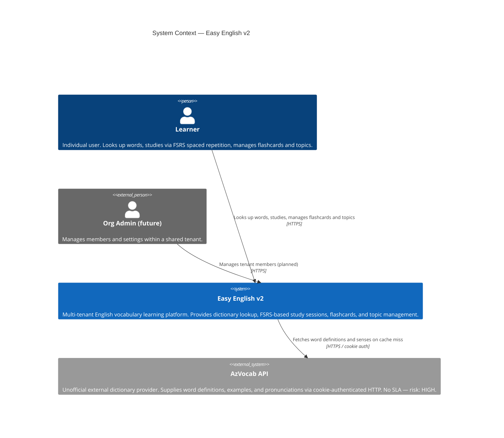

---

## 🏢 Container View

The system is composed of a React SPA, a NestJS modular-monolith API server, a single PostgreSQL database, an in-process memory cache, and one external dependency (AzVocab).

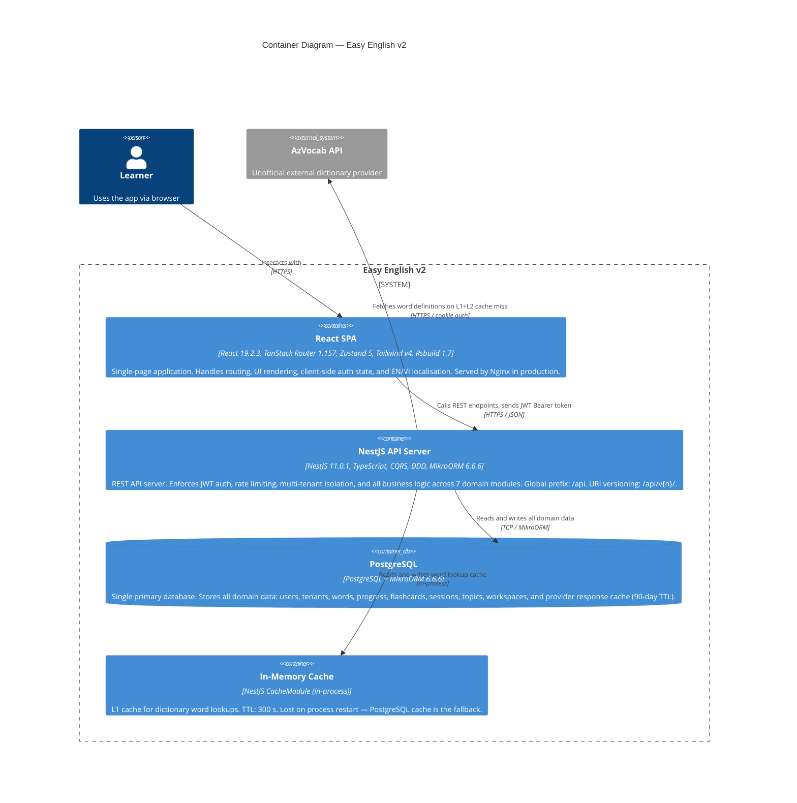

### Container Details

| Container | Technology | Purpose | Key Notes |
|---|---|---|---|
| **React SPA** | React 19.2.3, TanStack Router/Query, Zustand 5, Tailwind v4 | User interface | EN/VI i18n, JWT refresh via Axios interceptor, Rsbuild bundler |
| **NestJS API Server** | NestJS 11.0.1, TypeScript, CQRS, DDD | All business logic | Global JWT guard, ThrottlerGuard, ValidationPipe, Swagger at `/api/docs` |
| **PostgreSQL** | MikroORM 6.6.6 | Persistent storage | All domain data + raw provider response cache (90-day TTL) |
| **In-Memory Cache** | NestJS CacheModule | L1 word lookup cache | 300 s TTL, in-process, lost on restart |
| **AzVocab API** | External HTTP (unofficial) | Dictionary data | Cookie auth, no SLA, HIGH risk — mitigated by 2-tier cache |

---

## 🧩 Component View

### NestJS API Server

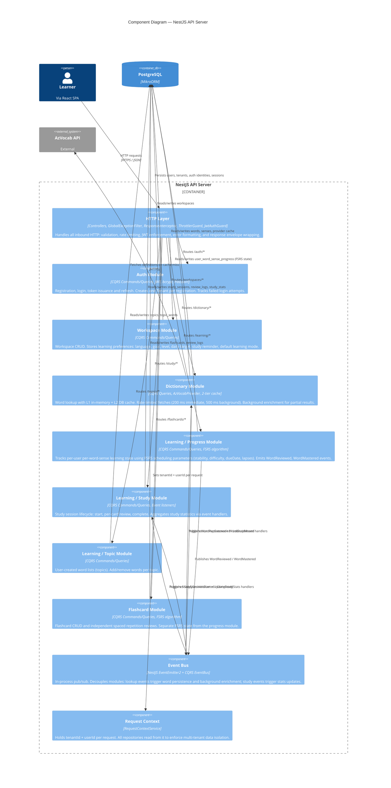

### Domain Module Architecture Highlights

#### Standard Module Layout
Every domain module follows the same layered structure — no exceptions:

```
modules/{name}/
├── controllers/          HTTP entrypoints (DTOs in, DTOs out)
├── application/
│   ├── commands/         Write ops — *.command.ts + *.handler.ts
│   ├── queries/          Read ops  — *.query.ts  + *.handler.ts
│   ├── events/           Domain event handlers (cross-module reactions)
│   └── ports/            Application-layer abstractions (interfaces)
├── domain/
│   ├── entities/         Domain entities & aggregates
│   ├── value-objects/    Immutable value objects
│   ├── events/           Domain event definitions
│   ├── exceptions/       Domain-specific errors
│   └── repositories/     Repository interfaces (ports)
├── infrastructure/
│   ├── persistence/      ORM entities (*.orm-entity.ts)
│   ├── repositories/     Repository implementations (MikroORM)
│   ├── services/         Infrastructure services (hashers, HTTP clients)
│   └── providers/        External provider adapters
└── dto/
    ├── requests/         Input DTOs (validated via class-validator)
    └── responses/        Output DTOs
```

#### Module Responsibilities

| Module | Commands | Queries | Events Published |
|---|---|---|---|
| `auth` | Register, Login, Refresh | GetSession, ValidateSession | UserRegistered, TenantCreated, LoginSucceeded |
| `workspace` | CreateWorkspace | ListWorkspaces, GetWorkspace, CheckHasWorkspace | WorkspaceCreated |
| `dictionary` | — | LookupWord, SearchWordSenses, GetWordSenseDetail | LookupSucceeded, LookupMissed, WordEnrichmentRequested |
| `learning/progress` | AddToLearning, RemoveFromLearning, ReviewWord | GetLearningList, GetLearnedStatus | WordReviewed, WordMastered, WordLearningStarted |
| `learning/study` | StartSession, ReviewInSession, CompleteSession | GetDueCards, GetQuizCards, GetSessionSummary, GetStudyStats | StudySessionStarted, StudySessionCompleted |
| `learning/topic` | CreateTopic, UpdateTopic, DeleteTopic, AddTopicWord, RemoveTopicWord | GetTopics, GetTopicDetail, ListTopicWords | TopicCreated, TopicWordAdded |
| `flashcard` | CreateFlashcard, UpdateFlashcard, DeleteFlashcard, ReviewCard | GetFlashcards, GetDueCards | FlashcardCreated, FlashcardUpdated |

### React SPA Component Structure

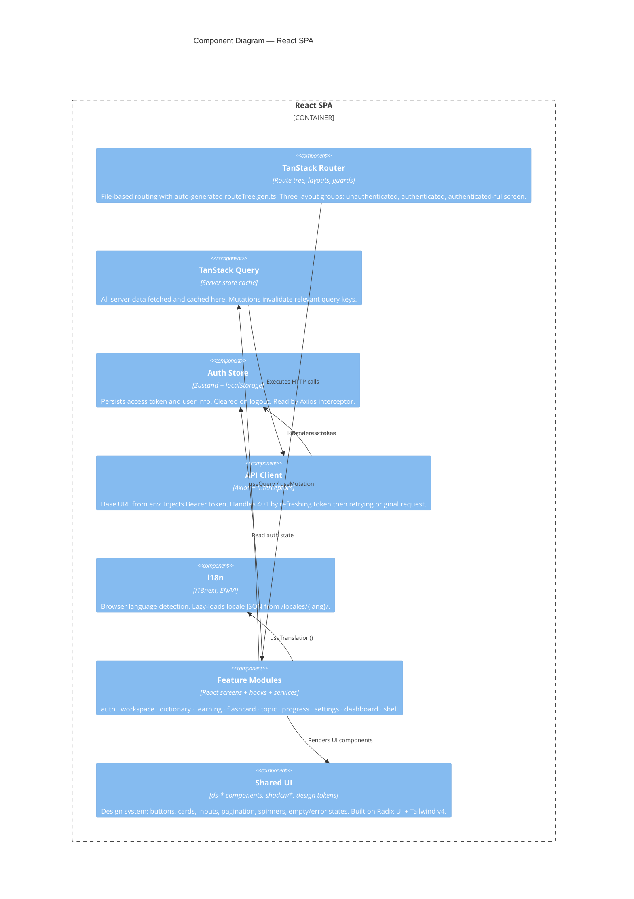

---

## 🔄 Runtime / Key Flows

### Registration + Tenant Creation

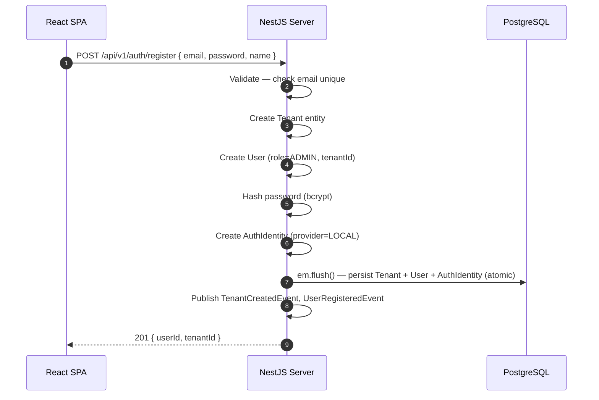

### Login + JWT Issuance

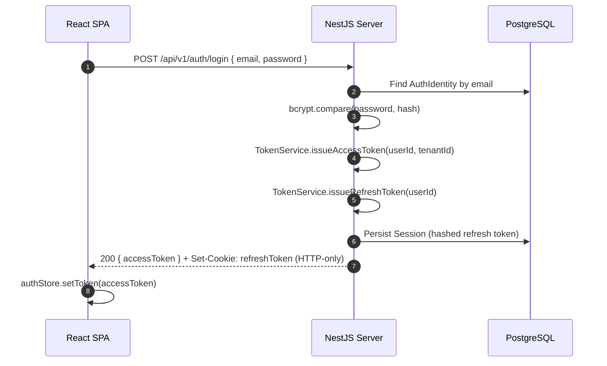

### Token Refresh (Axios interceptor)

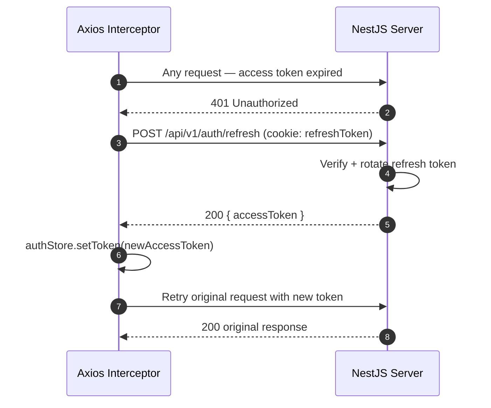

### Dictionary Lookup (2-tier cache)

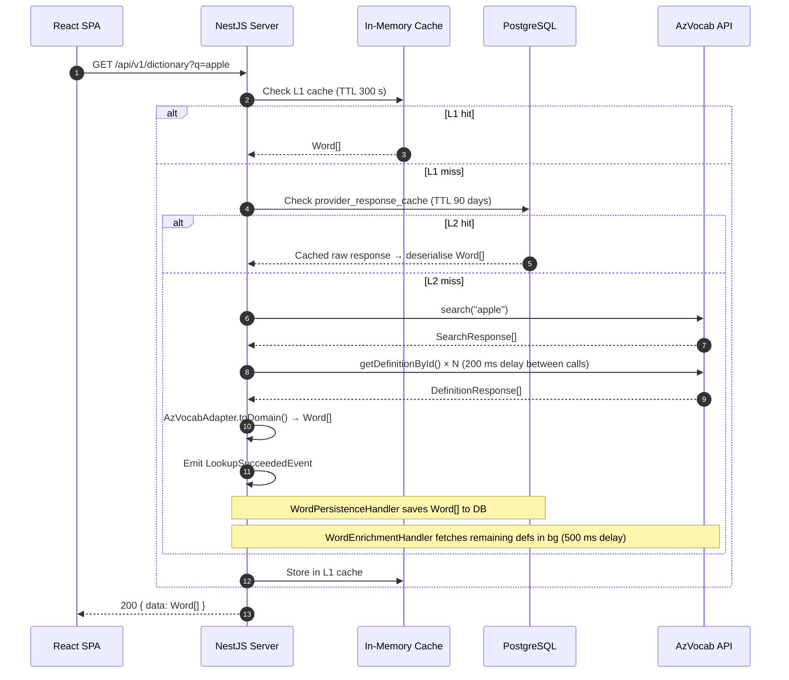

### Study Session Flow

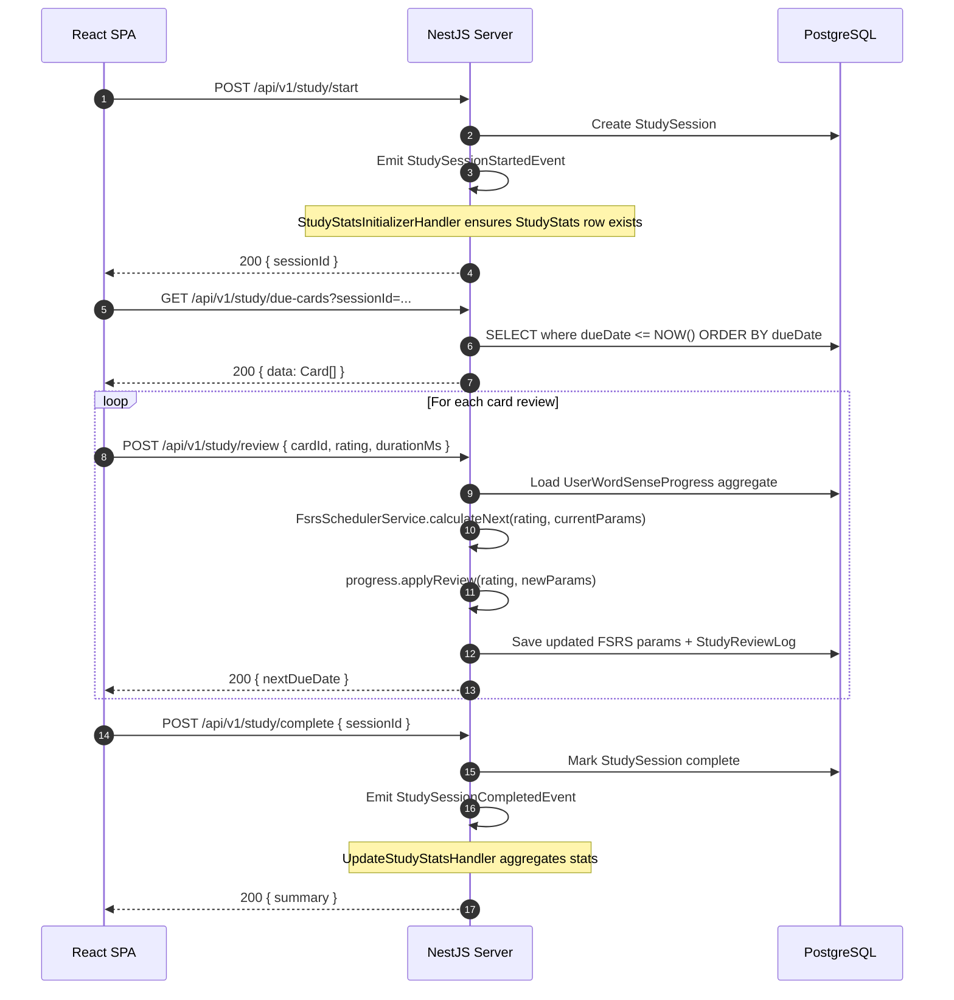

---

## 📊 Data Flow & State

### Cache Layers

```mermaid
flowchart TD
    REQ([Request: lookup word]) --> L1{L1: In-Memory Cache\nTTL 300 s}
    L1 -->|hit| RESP([Return Word[]])
    L1 -->|miss| L2{L2: provider_response_cache\nPostgreSQL · TTL 90 days}
    L2 -->|hit| DESER[Deserialise raw JSON → Word[]]
    DESER --> RESP
    L2 -->|miss| L3{L3: words + word_senses\nPostgreSQL — permanent}
    L3 -->|hit| RESP
    L3 -->|miss| AZ[AzVocab HTTP API\nexternal · unofficial]
    AZ -->|Word[]| PERSIST[WordPersistenceHandler\nsave to PostgreSQL]
    PERSIST --> RESP
    AZ -->|partial data| ENRICH[WordEnrichmentHandler\nbackground fetch remaining defs]
```

### FSRS State Machine (per word-sense per user)

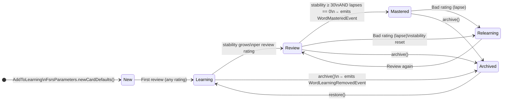

### Source of Truth

| Data | Table(s) | Notes |
|---|---|---|
| Users & auth | `users`, `auth_identities`, `sessions` | |
| Tenants | `tenants` | 1 per registration currently |
| Word definitions | `words`, `word_senses`, `word_examples`, `word_pronunciations` | Populated from AzVocab |
| Provider cache | `provider_response_cache` | 90-day TTL (404 responses: 24 h) |
| Learning progress | `user_word_sense_progress` | FSRS params per word-sense per user |
| Study data | `study_sessions`, `study_review_logs`, `study_stats` | |
| Flashcards | `flashcards`, `review_logs` | Independent from progress module |
| Topics | `topics`, `topic_words` | |
| Workspaces | `workspaces` | Per-user, per-tenant |
| Auth state (client) | Zustand `auth-store` → localStorage | Access token + user info |
| UI state (client) | TanStack Query cache + `appearance-store` | Ephemeral |

---

## 🚀 Deployment & Environment

### Current State

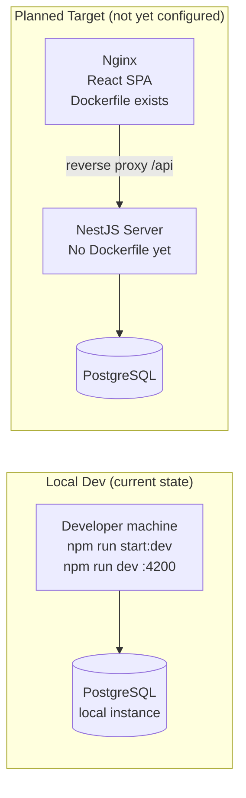

- **Not deployed.** Development is local only.
- Client has a Dockerfile (Node 20 build → Nginx Alpine SPA hosting).
- Server has **no Dockerfile** yet. No CI/CD pipeline (`.github/workflows/` is empty).

### Environment Variables

**Server:**

| Variable | Purpose |
|---|---|
| `DATABASE_URL` | PostgreSQL connection string |
| `JWT_SECRET` | JWT access token signing secret |
| `JWT_REFRESH_SECRET` | Refresh token signing secret |
| `AZVOCAB_API_URL` | AzVocab base URL |
| `AZVOCAB_COOKIE` | Cookie for AzVocab auth |
| `AZVOCAB_BUILD_ID` | Build ID parameter for AzVocab requests |
| `CORS_ORIGINS` | Allowed CORS origins |
| `PORT` | Server listen port |
| `NODE_ENV` | `development` or `production` |
| `PROVIDER_CACHE_TTL_DAYS` | DB cache TTL for provider responses (default: 90) |
| `MEMORY_CACHE_TTL_SECONDS` | In-memory cache TTL (default: 300) |

**Client:**

| Variable | Purpose |
|---|---|
| `RSBUILD_API_URL` | Backend API base URL |

---

## 🔌 Integration & External Dependencies

### AzVocab API

| Attribute | Value |
|---|---|
| Type | **Unofficial / reverse-engineered** |
| Auth | HTTP cookie (`AZVOCAB_COOKIE`) |
| Rate limiting | Manual delay: 200 ms (immediate fetches), 500 ms (background enrichment) |
| Immediate fetch limit | First 8 definitions fetched synchronously; rest deferred to background |
| On failure | `ServiceUnavailableException` (503) — no retry, no circuit breaker |
| Risk | **HIGH** — no SLA, no official support, can break without notice |
| Mitigation | Two-tier cache (in-memory 300 s + PostgreSQL 90 days) reduces live call volume significantly |

**No other external integrations exist.** No email, payment, push notification, analytics, or OAuth provider.

---

## 🔒 Security, Reliability & Observability

### Authentication Flow

```mermaid
flowchart TD
    REQ([Incoming request]) --> GUARD{JwtAuthGuard\nAPP_GUARD — global}
    GUARD -->|@Public decorator| PASS([Route handler])
    GUARD -->|valid JWT| CTX[RequestContextService\nsets tenantId + userId]
    CTX --> PASS
    GUARD -->|invalid / missing| ERR([401 Unauthorized])
```

### Security Controls

| Control | Implementation |
|---|---|
| **Authentication** | JWT access tokens (short-lived) + refresh tokens (HTTP-only cookie) |
| **Authorization** | Role on `User` entity: `ADMIN` / `MEMBER` — guard enforcement **[Needs Verification]** |
| **Multi-tenant isolation** | All queries scoped by `tenantId` via `RequestContextService` — **[Assumption: must audit]** |
| **Password hashing** | bcrypt via `BcryptPasswordHasherService` |
| **Login attempt tracking** | `LoginAttemptTrackerOrmEntity` — lockout logic **[Needs Verification]** |
| **Rate limiting** | Global `ThrottlerGuard` (configurable TTL/limit via `appConfig`) |
| **Input validation** | Global `ValidationPipe`: `whitelist: true, transform: true` |
| **Error handling** | `GlobalExceptionFilter` → standardized envelope; `neverthrow Result<T,E>` in domain |

### Reliability Risks

| Risk | Severity | Mitigation |
|---|---|---|
| AzVocab API breaks | HIGH | Two-tier cache reduces exposure |
| `tenantId` filter missing on a query | CRITICAL | Needs systematic audit of all repositories |
| In-memory cache lost on restart | LOW | PostgreSQL L2 cache is fallback |
| No retry / circuit-breaker on AzVocab | MEDIUM | Open risk |
| No CI/CD — manual deploys | MEDIUM | Accepted for now |

### Observability

| Capability | Status |
|---|---|
| Logging | NestJS `Logger` (not structured — no Pino/Winston) |
| Tracing | Not implemented |
| Metrics | Not implemented |
| Correlation IDs | Present in response envelope — generation **[Needs Verification]** |
| API docs | Swagger at `{domain}/api/docs` — always on |

---

## 💼 Business View

### Stakeholder Alignment

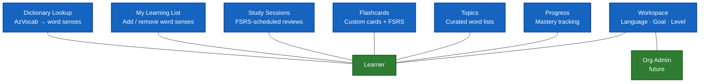

### Business Value Flow

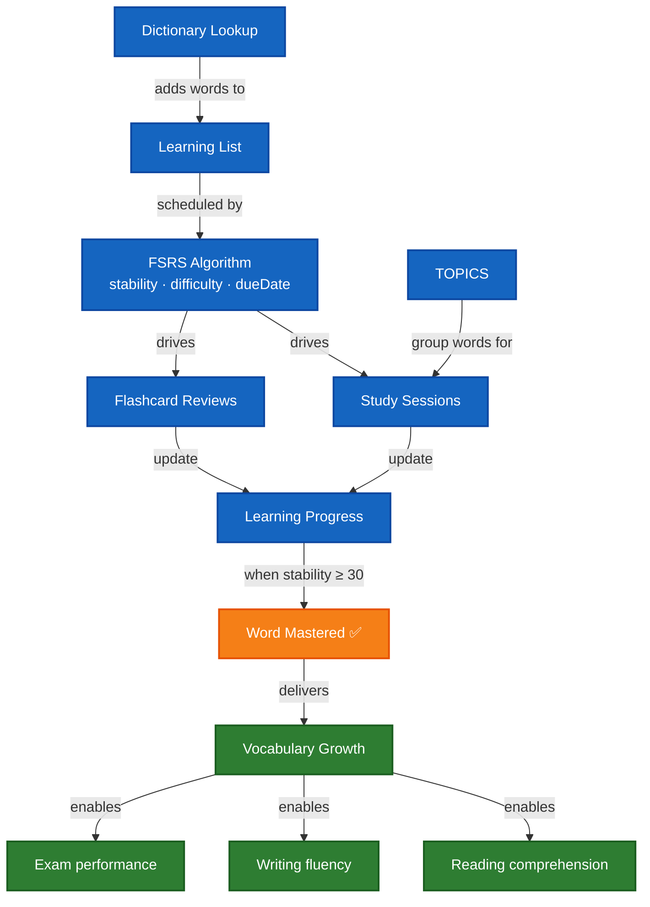

---

## 📐 Technology Stack

### Backend (Server)

| Technology | Version | Purpose |
|---|---|---|
| **NestJS** | 11.0.1 | API framework — modules, DI, guards, interceptors |
| **TypeScript** | 5.x | Type safety across the backend |
| **MikroORM** | 6.6.6 | ORM — PostgreSQL driver, migrations |
| **@nestjs/cqrs** | 11.0.3 | Command/Query bus |
| **@nestjs/event-emitter** | 3.0.1 | In-process domain events |
| **@nestjs/jwt** | 11.0.2 | JWT signing and verification |
| **@nestjs/passport** | 11.0.5 | Passport integration (JWT strategy) |
| **@nestjs/throttler** | 6.5.0 | Rate limiting |
| **@nestjs/swagger** | 11.2.5 | OpenAPI documentation |
| **@nestjs/cache-manager** | 3.1.0 | In-memory L1 cache |
| **@nestjs/axios** | 4.0.1 | HTTP client (AzVocab calls) |
| **neverthrow** | 8.2.0 | `Result<T, E>` functional error handling |
| **bcrypt** | 6.0.0 | Password hashing |
| **class-validator** | 0.14.3 | DTO input validation |
| **cookie-parser** | 1.4.7 | HTTP-only refresh token cookies |

### Frontend (Client)

| Technology | Version | Purpose |
|---|---|---|
| **React** | 19.2.3 | UI framework |
| **TanStack Router** | 1.157.18 | File-based routing, type-safe |
| **TanStack Query** | 5.90.20 | Server state management |
| **Zustand** | 5.0.11 | Client state (auth, appearance) |
| **React Hook Form** | 7.71.1 | Form management |
| **Zod** | 4.3.6 | Schema validation |
| **Axios** | 1.13.4 | HTTP client with interceptors |
| **Tailwind CSS** | 4.x | Utility-first styling |
| **Radix UI** | 1.4.3 | Headless UI primitives |
| **Motion** | 12.33.0 | Animations |
| **i18next** | — | EN/VI localisation |
| **Rsbuild** | 1.7.1 | Rspack-based build tool |

---

## 🗂️ Architecture Decision Records

| ID | Decision | Rationale |
|---|---|---|
| **ADR-001** | Domain-Driven Design | Align backend code structure with business domain boundaries; enable clear ubiquitous language per module |
| **ADR-002** | CQRS (Command Query Responsibility Segregation) | Separate write and read concerns; enable independent scaling and optimization of each path |
| **ADR-003** | Multi-tenant: Shared Database, Row-level Isolation | Simpler than schema-per-tenant; all queries scoped by `tenantId` column |
| **ADR-004** | TanStack Query for server state | Declarative data fetching, automatic caching, background refetch, stale-while-revalidate built-in |
| **ADR-005** | Zustand for client state | Minimal boilerplate, no context providers needed, persistence via `zustand/middleware` |

---

## ✅ Architecture Summary

### Backend Excellence
- ✅ **NestJS 11 + TypeScript** — strict module boundaries, full type safety
- ✅ **DDD + CQRS** — clean separation of commands, queries, and domain events
- ✅ **FSRS algorithm** — research-backed spaced repetition scheduling
- ✅ **Multi-tenant isolation** — `tenantId` scoped on all entities
- ✅ **2-tier dictionary cache** — in-memory (300 s) + PostgreSQL (90 days) reduces AzVocab dependency
- ✅ **neverthrow Result<T,E>** — explicit error paths, no silent failures in domain layer

### Frontend Excellence
- ✅ **React 19.2.3** — latest concurrent rendering
- ✅ **TanStack Router + Query** — type-safe routing and data fetching
- ✅ **Rsbuild** — fast Rspack-based builds
- ✅ **EN/VI i18n** — browser language detection + lazy locale loading
- ✅ **JWT auto-refresh** — transparent token renewal via Axios interceptor

### Architecture Risks (Open)
- ⚠️ **AzVocab** — unofficial API, HIGH risk, no SLA
- ⚠️ **No CI/CD** — manual deploys, no automated quality gates
- ⚠️ **No server Dockerfile** — deployment not yet containerized
- ⚠️ **tenantId isolation audit** — needs systematic verification across all repositories

---

## 📋 Documentation Portfolio

### Required C4 Views

| View | Section | Status |
|---|---|---|
| **System Context** | [System Context](#-system-context) | ✅ Complete |
| **Container** | [Container View](#-container-view) | ✅ Complete |
| **Component — Server** | [NestJS API Server](#nestjs-api-server) | ✅ Complete |
| **Component — Client** | [React SPA Component Structure](#react-spa-component-structure) | ✅ Complete |

### Related Documents

| Document | Type | Path |
|---|---|---|
| Architecture Overview | Current | [architecture/architecture-overview.md](architecture/architecture-overview.md) |
| CQRS Guidelines | Current | [architecture/cqrs-guidelines.md](architecture/cqrs-guidelines.md) |
| Multi-tenant Design | Current | [architecture/multi-tenant-design.md](architecture/multi-tenant-design.md) |
| Module Structure | Current | [architecture/module-structure.md](architecture/module-structure.md) |
| ADR Index | Decision records | [adr/README.md](adr/README.md) |
| Auth Domain | Domain | [domain/auth/README.md](domain/auth/README.md) |
| Dictionary Domain | Domain | [domain/dictionary/README.md](domain/dictionary/README.md) |
| Learning Domain | Domain | [domain/learning/README.md](domain/learning/README.md) |
| Coding Standards | Dev guide | [dev/coding-standards.md](dev/coding-standards.md) |
| Git Workflow | Dev guide | [dev/git-workflow.md](dev/git-workflow.md) |

---

## ❓ Open Questions / Unknowns

| # | Question | Where to look |
|---|---|---|
| OQ1 | Is `tenantId` filter enforced on **every** repository query? A missing filter = data leak. | Audit all `*.repository.ts` files |
| OQ2 | Is there a role-based guard (`ADMIN` vs `MEMBER`) on any endpoint? | Search controllers for `@Roles()` |
| OQ3 | What is the lockout behaviour in `LoginAttemptTrackerOrmEntity`? Max attempts? Duration? | `login.handler.ts`, `login-attempt-tracker.orm-entity.ts` |
| OQ4 | Is `correlationId` in the response envelope generated server-side per request? | `response.interceptor.ts`, `api-response.dto.ts` |
| OQ5 | What is the production deployment target? (VPS, Render, Railway, Docker Compose?) | Team decision |
| OQ6 | Can a tenant have multiple users (invite flow)? | `register.handler.ts` — no invite flow found |
| OQ7 | Is `@node-rs/argon2` planned as bcrypt replacement, or unused? | `server/package.json` |
| OQ8 | Single AzVocab provider permanently, or fallback chain planned? | `lookup-provider.interface.ts` |

---

*Last updated: 2026-04-29 · Generated from codebase scan · Verify assumptions against code before acting.*
