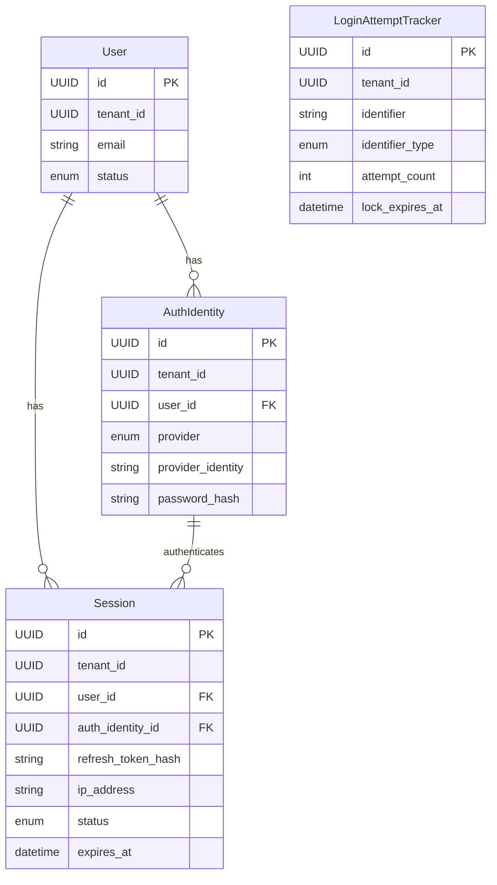

# Data Model: Local Authentication Login Flow

**Feature**: Local Authentication Login Flow  
**Date**: 2026-02-04  
**Plan**: [plan.md](file:///e:/Projects/multi-tenant/easy-english-v2/specs/002-local-auth-login/plan.md)  
**Research**: [research.md](file:///e:/Projects/multi-tenant/easy-english-v2/specs/002-local-auth-login/research.md)

---

## Overview

This document defines the domain entities, value objects, and database schema for the Local Authentication Login Flow feature. All entities are tenant-scoped and follow DDD principles with a clear separation between domain models and persistence models (ORM entities).

---

## Domain Entities

### 1. User (Aggregate Root)

**Responsibility**: Represents a registered account in the system.

**Attributes**:
```typescript
class User extends AggregateRoot {
  id: UUID;
  tenantId: UUID;                // Multi-tenancy (§3)
  email: Email;             // Value Object
  status: UserStatus;            // ACTIVE | BLOCKED
  createdAt: Date;
  updatedAt: Date;
}

enum UserStatus {
  ACTIVE = 'ACTIVE',
  BLOCKED = 'BLOCKED',
}
```

**Business Rules**:
- BR-003: BLOCKED users cannot log in
- Email is unique per tenant (enforced at database level)

**Invariants**:
- Email cannot be null or empty
- Status must be either ACTIVE or BLOCKED

---

### 2. AuthIdentity (Aggregate)

**Responsibility**: Represents a credential identity used to authenticate a User. Supports multiple authentication providers (LOCAL, OAUTH, etc.).

**Attributes**:
```typescript
class AuthIdentity extends AggregateRoot {
  id: UUID;
  tenantId: UUID;                // Multi-tenancy (§3)
  userId: UUID;                  // Reference to User aggregate
  provider: AuthProvider;        // LOCAL | OAUTH | etc.
  providerIdentity: string;      // Email for LOCAL, Google ID for OAUTH, etc.
  passwordHash: string | null;   // Only for LOCAL provider (argon2 hash)
  createdAt: Date;
  updatedAt: Date;

  // Domain methods
  verifyPassword(plainPassword: string): Promise<boolean>;
  updatePasswordHash(newPasswordHash: string): void;
}

enum AuthProvider {
  LOCAL = 'LOCAL',
  OAUTH = 'OAUTH',
  // Future providers: SAML, LDAP, etc.
}
```

**Business Rules**:
- BR-001: Only one AuthIdentity per (tenantId, provider, providerIdentity) combination
- BR-002: Password verification logic resides in AuthIdentity aggregate (FR-012)
- BR-004: Password hash uses argon2id algorithm (see research.md)

**Invariants**:
- `providerIdentity` must be normalized (lowercase, trimmed) for LOCAL provider
- `passwordHash` is required for LOCAL provider, null for others
- Each User can have multiple AuthIdentities (e.g., LOCAL + OAUTH), but only one per provider

**Domain Methods**:
```typescript
async verifyPassword(plainPassword: string): Promise<boolean> {
  if (this.provider !== AuthProvider.LOCAL || !this.passwordHash) {
    return false;
  }
  return await argon2.verify(this.passwordHash, plainPassword);
}
```

---

### 3. Session (Aggregate)

**Responsibility**: Represents an active authenticated session for a User via a specific AuthIdentity.

**Attributes**:
```typescript
class Session extends AggregateRoot {
  id: UUID;
  tenantId: UUID;                // Multi-tenancy (§3)
  userId: UUID;                  // Reference to User aggregate
  authIdentityId: UUID;          // Reference to AuthIdentity aggregate
  refreshTokenHash: string;      // One-way hash of refresh token (argon2)
  ipAddress: string;             // IP address of client (for audit)
  userAgent: string;             // User agent of client (for audit)
  status: SessionStatus;         // ACTIVE | EXPIRED | REVOKED
  createdAt: Date;
  expiresAt: Date;               // Access token expiration (7 days from createdAt)
  refreshExpiresAt: Date;        // Refresh token expiration (30 days from createdAt)

  // Domain methods
  static create(params: CreateSessionParams): Session;
  isExpired(): boolean;
  isValid(): boolean;
  revoke(): void;
}

enum SessionStatus {
  ACTIVE = 'ACTIVE',
  EXPIRED = 'EXPIRED',
  REVOKED = 'REVOKED',
}

interface CreateSessionParams {
  tenantId: UUID;
  userId: UUID;
  authIdentityId: UUID;
  refreshTokenHash: string;
  ipAddress: string;
  userAgent: string;
  accessTokenExpirationMinutes: number;   // From env config (default: 10080 = 7 days)
  refreshTokenExpirationMinutes: number;  // From env config (default: 43200 = 30 days)
}
```

**Business Rules**:
- BR-006: Successful login MUST always create a new Session (no reuse)
- BR-007: Refresh tokens are stored as one-way hashes (argon2) and are one-time-use
- BR-009: A User MUST NOT have more than 5 concurrent active sessions; oldest is auto-revoked

**Invariants**:
- Each session is tied to exactly one User and one AuthIdentity
- `expiresAt` > `createdAt`
- `refreshExpiresAt` > `expiresAt`
- `refreshTokenHash` is immutable after creation (new session created on refresh)

**Domain Methods**:
```typescript
static create(params: CreateSessionParams): Session {
  const now = new Date();
  const session = new Session();
  session.id = UUID.generate();
  session.tenantId = params.tenantId;
  session.userId = params.userId;
  session.authIdentityId = params.authIdentityId;
  session.refreshTokenHash = params.refreshTokenHash;
  session.ipAddress = params.ipAddress;
  session.userAgent = params.userAgent;
  session.status = SessionStatus.ACTIVE;
  session.createdAt = now;
  session.expiresAt = new Date(now.getTime() + params.accessTokenExpirationMinutes * 60 * 1000);
  session.refreshExpiresAt = new Date(now.getTime() + params.refreshTokenExpirationMinutes * 60 * 1000);
  
  return session;
}

isExpired(): boolean {
  return new Date() > this.expiresAt;
}

isValid(): boolean {
  return this.status === SessionStatus.ACTIVE && !this.isExpired();
}

revoke(): void {
  this.status = SessionStatus.REVOKED;
}
```

---

### 4. LoginAttemptTracker (Entity)

**Responsibility**: Tracks failed login attempts for security monitoring and rate limiting (enables infrastructure-layer brute-force protection).

**Attributes**:
```typescript
class LoginAttemptTracker extends Entity {
  id: UUID;
  tenantId: UUID;                // Multi-tenancy (§3)
  identifier: string;            // Email or IP address
  identifierType: IdentifierType; // EMAIL | IP
  attemptCount: number;          // Number of failed attempts in current window
  firstAttemptAt: Date;          // Start of current window
  lastAttemptAt: Date;           // Most recent failed attempt
  lockExpiresAt: Date | null;    // When lockout expires (null if not locked)
  flaggedForReview: boolean;     // True if exceeds threshold (20+ attempts)
  createdAt: Date;
  updatedAt: Date;

  // Domain methods
  recordFailedAttempt(): void;
  clearAttempts(): void;
  isLocked(): boolean;
  getRemainingLockTime(): number;
}

enum IdentifierType {
  EMAIL = 'EMAIL',
  IP = 'IP',
}
```

**Business Rules**:
- FR-015: Track failed login attempts by email and IP address
- Domain layer provides data; infrastructure layer enforces rate limits

**Invariants**:
- `attemptCount` >= 0
- If `lockExpiresAt` is not null, `lockExpiresAt` > `lastAttemptAt`

**Domain Methods**:
```typescript
recordFailedAttempt(): void {
  this.attemptCount++;
  this.lastAttemptAt = new Date();

  // Lockout thresholds (from research.md)
  if (this.attemptCount >= 20) {
    this.flaggedForReview = true;
  } else if (this.attemptCount >= 10) {
    // 1 hour lockout
    this.lockExpiresAt = new Date(Date.now() + 60 * 60 * 1000);
  } else if (this.attemptCount >= 5) {
    // 15 minute lockout
    this.lockExpiresAt = new Date(Date.now() + 15 * 60 * 1000);
  }
}

clearAttempts(): void {
  this.attemptCount = 0;
  this.lockExpiresAt = null;
  this.flaggedForReview = false;
}

isLocked(): boolean {
  return this.lockExpiresAt !== null && this.lockExpiresAt > new Date();
}

getRemainingLockTime(): number {
  if (!this.isLocked()) return 0;
  return Math.ceil((this.lockExpiresAt!.getTime() - Date.now()) / 60000); // Minutes
}
```

---

## Value Objects

### Email

**Responsibility**: Validates and normalizes email addresses.

```typescript
class Email extends ValueObject {
  private readonly value: string;

  constructor(email: string) {
    super();
    this.value = this.normalize(email);
    this.validate();
  }

  private normalize(email: string): string {
    return email.trim().toLowerCase(); // FR-014: Normalize emails
  }

  private validate(): void {
    const emailRegex = /^[^\s@]+@[^\s@]+\.[^\s@]+$/;
    if (!emailRegex.test(this.value)) {
      throw new InvalidEmailException(this.value);
    }
  }

  getValue(): string {
    return this.value;
  }

  equals(other: Email): boolean {
    return this.value === other.value;
  }
}
```

---

## Domain Events

### LoginSucceeded

**When**: After successful credential verification and session creation.

```typescript
class LoginSucceeded extends DomainEvent {
  constructor(
   public readonly userId: UUID,
    public readonly tenantId: UUID,
    public readonly authIdentityId: UUID,
    public readonly sessionId: UUID,
    public readonly ipAddress: string,
    public readonly userAgent: string,
    public readonly timestamp: Date,
  ) {
    super();
  }
}
```

### LoginFailed

**When**: After failed credential verification.

```typescript
class LoginFailed extends DomainEvent {
  constructor(
    public readonly email: string,           // Attempted email
    public readonly reason: FailureReason,  // INVALID_CREDENTIALS | ACCOUNT_BLOCKED
    public readonly tenantId: UUID | null,  // Null if user doesn't exist
    public readonly ipAddress: string,
    public readonly userAgent: string,
    public readonly timestamp: Date,
  ) {
    super();
  }
}

enum FailureReason {
  INVALID_CREDENTIALS = 'INVALID_CREDENTIALS',  // Wrong password or non-existent user
  ACCOUNT_BLOCKED = 'ACCOUNT_BLOCKED',
  ACCOUNT_LOCKED = 'ACCOUNT_LOCKED',           // Too many failed attempts
}
```

### SessionCreated

**When**: After new session is saved to database.

```typescript
class SessionCreated extends DomainEvent {
  constructor(
    public readonly sessionId: UUID,
    public readonly userId: UUID,
    public readonly tenantId: UUID,
    public readonly expiresAt: Date,
    public readonly timestamp: Date,
  ) {
    super();
  }
}
```

---

## Database Schema (PostgreSQL)

### Table: `users` (EXISTING)

Assuming this table already exists from registration feature.

```sql
CREATE TABLE users (
  id UUID PRIMARY KEY DEFAULT gen_random_uuid(),
  tenant_id UUID NOT NULL,
  email VARCHAR(255) NOT NULL,
  status VARCHAR(20) NOT NULL DEFAULT 'ACTIVE' CHECK (status IN ('ACTIVE', 'BLOCKED')),
  created_at TIMESTAMP NOT NULL DEFAULT NOW(),
  updated_at TIMESTAMP NOT NULL DEFAULT NOW(),
  
  UNIQUE (tenant_id, email)
);

CREATE INDEX idx_users_tenant_email ON users(tenant_id, email);
CREATE INDEX idx_users_status ON users(status);
```

### Table: `auth_identities`

```sql
CREATE TABLE auth_identities (
  id UUID PRIMARY KEY DEFAULT gen_random_uuid(),
  tenant_id UUID NOT NULL,
  user_id UUID NOT NULL REFERENCES users(id) ON DELETE CASCADE,
  provider VARCHAR(50) NOT NULL,
  provider_identity VARCHAR(255) NOT NULL,
  password_hash TEXT,  -- Only for LOCAL provider
  created_at TIMESTAMP NOT NULL DEFAULT NOW(),
  updated_at TIMESTAMP NOT NULL DEFAULT NOW(),
  
  UNIQUE (tenant_id, provider, provider_identity)
);

CREATE INDEX idx_auth_identities_user ON auth_identities(user_id);
CREATE INDEX idx_auth_identities_provider ON auth_identities(tenant_id, provider, provider_identity);
```

### Table: `sessions`

```sql
CREATE TABLE sessions (
  id UUID PRIMARY KEY DEFAULT gen_random_uuid(),
  tenant_id UUID NOT NULL,
  user_id UUID NOT NULL REFERENCES users(id) ON DELETE CASCADE,
  auth_identity_id UUID NOT NULL REFERENCES auth_identities(id) ON DELETE CASCADE,
  refresh_token_hash TEXT NOT NULL,
  ip_address VARCHAR(45) NOT NULL,  -- IPv6 max length
  user_agent TEXT,
  status VARCHAR(20) NOT NULL DEFAULT 'ACTIVE' CHECK (status IN ('ACTIVE', 'EXPIRED', 'REVOKED')),
  created_at TIMESTAMP NOT NULL DEFAULT NOW(),
  expires_at TIMESTAMP NOT NULL,
  refresh_expires_at TIMESTAMP NOT NULL,
  
  CHECK (expires_at > created_at),
  CHECK (refresh_expires_at > expires_at)
);

CREATE INDEX idx_sessions_user ON sessions(user_id);
CREATE INDEX idx_sessions_status_expires ON sessions(status, expires_at);  -- For cleanup job
CREATE INDEX idx_sessions_user_status ON sessions(user_id, status);        -- For session limit check
```

### Table: `login_attempt_trackers`

```sql
CREATE TABLE login_attempt_trackers (
  id UUID PRIMARY KEY DEFAULT gen_random_uuid(),
  tenant_id UUID NOT NULL,
  identifier VARCHAR(255) NOT NULL,  -- Email or IP address
  identifier_type VARCHAR(10) NOT NULL CHECK (identifier_type IN ('EMAIL', 'IP')),
  attempt_count INTEGER NOT NULL DEFAULT 0,
  first_attempt_at TIMESTAMP NOT NULL DEFAULT NOW(),
  last_attempt_at TIMESTAMP NOT NULL DEFAULT NOW(),
  lock_expires_at TIMESTAMP,
  flagged_for_review BOOLEAN NOT NULL DEFAULT FALSE,
  created_at TIMESTAMP NOT NULL DEFAULT NOW(),
  updated_at TIMESTAMP NOT NULL DEFAULT NOW(),
  
  UNIQUE (tenant_id, identifier_type, identifier),
  CHECK (attempt_count >= 0)
);

CREATE INDEX idx_login_attempts_identifier ON login_attempt_trackers(tenant_id, identifier_type, identifier);
CREATE INDEX idx_login_attempts_flagged ON login_attempt_trackers(flagged_for_review) WHERE flagged_for_review = TRUE;
```

---

## Relationships



---

## Migration Strategy

1. **Check if `users` table exists** (likely from registration feature)
2. **Create `auth_identities` table** (new)
3. **Create `sessions` table** (new)
4. **Create `login_attempt_trackers` table** (new)
5. **Migrate existing users** (if applicable):
   - For each existing user with a password, create corresponding LOCAL AuthIdentity
   - Link `user.id` ↔ `auth_identity.user_id`

**Migration Script** (pseudo-code):
```sql
-- Migration: 002_create_auth_login_tables

-- 1. Create auth_identities table
CREATE TABLE auth_identities (...);

-- 2. Create sessions table
CREATE TABLE sessions (...);

-- 3. Create login_attempt_trackers table
CREATE TABLE login_attempt_trackers (...);

-- 4. Migrate existing users (if users have passwords stored elsewhere)
-- INSERT INTO auth_identities (tenant_id, user_id, provider, provider_identity, password_hash)
-- SELECT tenant_id, id, 'LOCAL', email, password FROM users WHERE password IS NOT NULL;
```

---

## Validation Rules

### AuthIdentity
- `providerIdentity` format depends on `provider`:
  - LOCAL: Must be valid email (use Email VO)
  - OAUTH: Provider-specific ID format
- `passwordHash` required only for LOCAL provider

### Session
- `expiresAt` must be in future
- `refreshExpiresAt` must be after `expiresAt`
- Maximum 5 active sessions per user per tenant (enforced in LoginCommandHandler)

### LoginAttemptTracker
- `attemptCount` cannot be negative
- If `lockExpiresAt` is set, it must be in the future

---

## Repository Interfaces

### IUserRepository
```typescript
interface IUserRepository {
  findById(id: UUID, tenantId: UUID): Promise<User | null>;
  findByEmail(email: Email, tenantId: UUID): Promise<User | null>;
  save(user: User): Promise<void>;
}
```

### IAuth IdentityRepository
```typescript
interface IAuthIdentityRepository {
  findByProviderIdentity(provider: AuthProvider, providerIdentity: string, tenantId: UUID): Promise<AuthIdentity | null>;
  findByUserId(userId: UUID, tenantId: UUID): Promise<AuthIdentity[]>;
  save(authIdentity: AuthIdentity): Promise<void>;
}
```

### ISessionRepository
```typescript
interface ISessionRepository {
  findById(id: UUID, tenantId: UUID): Promise<Session | null>;
  findActiveByUserId(userId: UUID, tenantId: UUID): Promise<Session[]>;
  countActiveByUserId(userId: UUID, tenantId: UUID): Promise<number>;
  findOldestActiveByUserId(userId: UUID, tenantId: UUID): Promise<Session | null>;
  save(session: Session): Promise<void>;
  delete(session: Session): Promise<void>;
}
```

### ILoginAttemptTrackerRepository
```typescript
interface ILoginAttemptTrackerRepository {
  findByIdentifier(identifier: string, identifierType: IdentifierType, tenantId: UUID): Promise<LoginAttemptTracker | null>;
  save(tracker: LoginAttemptTracker): Promise<void>;
}
```

---

## Next Steps

Proceed to generate API contracts in `/contracts/` directory (Phase 1).
