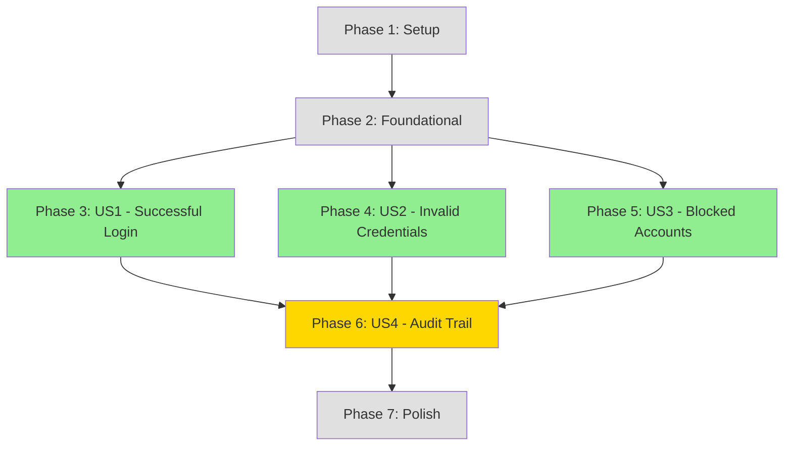

# Implementation Tasks: Local Authentication Login Flow

**Feature**: Local Authentication Login Flow  
**Branch**: `002-local-auth-login`  
**Date**: 2026-02-04

---

## Overview

This document provides a complete, dependency-ordered task breakdown for implementing the Local Authentication Login Flow feature. Tasks are organized by user story to enable independent, incremental delivery.

**Total Tasks**: 67  
**Parallelizable Tasks**: 42  
**User Stories**: 4 (US1-US3: P1, US4: P2)

**Suggested MVP**: US1-US3 (core login + security) = ~45 tasks

---

## Implementation Strategy

### Incremental Delivery Plan

1. **Phase 1-2: Foundation** (Setup + Foundational) - Enables all user stories
2. **Phase 3: US1** (Successful Login) - First complete, testable increment
3. **Phase 4: US2** (Invalid Credentials) - Security hardening
4. **Phase 5: US3** (Blocked Accounts) - Admin control
5. **Phase 6: US4** (Audit Trail) - Observability (P2, can defer)
6. **Phase 7: Polish** - Cross-cutting improvements

### Parallel Execution Opportunities

Each user story phase has numerous `[P]` tasks that can be executed in parallel:
- **US1**: 18 parallel tasks (models, services, UI components)
- **US2**: 8 parallel tasks (error handlers, validators)
- **US3**: 5 parallel tasks (account status checks)
- **US4**: 6 parallel tasks (event handlers, subscribers)

---

## Dependencies Between User Stories

**Key**: 🟢 P1 (Must-have) | 🟡 P2 (Nice-to-have) | ⚪ Infrastructure

**Independent**: US2 and US3 can be implemented in parallel after US1  
**Blocking**: Foundation phase must complete before any user story  
**Optional**: US4 (audit) can be deferred post-MVP

---

## Phase 1: Setup (Project Initialization)

**Goal**: Prepare development environment and install dependencies.

### Tasks

- [ ] T001 Install backend dependencies: `@node-rs/argon2`, `@nestjs/jwt`, `@nestjs/passport`, `passport-jwt`, `@nestjs/schedule`
- [ ] T002 Install frontend dependencies: `@tanstack/react-query`, `axios` (if not already installed)
- [ ] T003 Generate RSA key pair for JWT signing in `server/keys/` directory
- [ ] T004 Configure backend environment variables in `server/.env` (JWT paths, cookie settings, rate limiting, argon2 config)
- [ ] T005 Configure frontend environment variables in `client/.env` (API base URL)
- [ ] T006 Enable CORS with credentials support in `server/src/main.ts` (set `credentials: true`, `origin` from env)

---

## Phase 2: Foundational (Blocking Prerequisites)

**Goal**: Implement shared domain infrastructure that all user stories depend on.

**Independent Test Criteria**: Domain entities can be instantiated, repositories can save/retrieve entities, value objects validate correctly.

### Database Schema

- [ ] T007 Create migration file `CreateAuthLoginTables` in `server/src/migrations/`
- [ ] T008 Define `auth_identities` table schema with tenant_id, user_id, provider, provider_identity, password_hash columns
- [ ] T009 Define `sessions` table schema with tenant_id, user_id, auth_identity_id, refresh_token_hash, status, expires_at columns
- [ ] T010 Define `login_attempt_trackers` table schema with tenant_id, identifier, identifier_type, attempt_count, lock_expires_at columns
- [ ] T011 Run database migration to create tables

### Domain Layer - Value Objects

- [ ] T012 [P] Create Email value object in `server/src/modules/auth/domain/value-objects/email.vo.ts` (normalization, validation)

### Domain Layer - Entities

- [ ] T013 [P] Create AuthIdentity entity in `server/src/modules/auth/domain/entities/auth-identity.entity.ts` (verifyPassword method, passwordHash attribute)
- [ ] T014 [P] Create Session entity in `server/src/modules/auth/domain/entities/session.entity.ts` (create factory, isExpired, isValid, revoke methods)
- [ ] T015 [P] Create LoginAttemptTracker entity in `server/src/modules/auth/domain/entities/login-attempt-tracker.entity.ts` (recordFailedAttempt, isLocked, getRemainingLockTime methods)

### Domain Layer - Repository Interfaces

- [ ] T016 [P] Define IAuthIdentityRepository interface in `server/src/modules/auth/domain/repositories/auth-identity.repository.interface.ts`
- [ ] T017 [P] Define ISessionRepository interface in `server/src/modules/auth/domain/repositories/session.repository.interface.ts`
- [ ] T018 [P] Define ILoginAttemptTrackerRepository interface in `server/src/modules/auth/domain/repositories/login-attempt-tracker.repository.interface.ts`

### Infrastructure Layer - ORM Entities

- [ ] T019 [P] Create AuthIdentity ORM entity in `server/src/modules/auth/infrastructure/persistence/auth-identity.orm-entity.ts` (MikroORM mappings)
- [ ] T020 [P] Create Session ORM entity in `server/src/modules/auth/infrastructure/persistence/session.orm-entity.ts` (MikroORM mappings)
- [ ] T021 [P] Create LoginAttemptTracker ORM entity in `server/src/modules/auth/infrastructure/persistence/login-attempt-tracker.orm-entity.ts` (MikroORM mappings)

### Infrastructure Layer - Repository Implementations

- [ ] T022 [P] Implement AuthIdentityRepository in `server/src/modules/auth/infrastructure/repositories/auth-identity.repository.ts` (findByProviderIdentity, save methods)
- [ ] T023 [P] Implement SessionRepository in `server/src/modules/auth/infrastructure/repositories/session.repository.ts` (save, findActiveByUserId, countActiveByUserId methods)
- [ ] T024 [P] Implement LoginAttemptTrackerRepository in `server/src/modules/auth/infrastructure/repositories/login-attempt-tracker.repository.ts` (findByIdentifier, save methods)

### Infrastructure Layer - Services

- [ ] T025 [P] Create PasswordHasherService in `server/src/modules/auth/infrastructure/services/password-hasher.service.ts` (argon2 hash, verify methods)
- [ ] T026 [P] Create TokenGeneratorService in `server/src/modules/auth/infrastructure/services/token-generator.service.ts` (generateAccessToken, generateRefreshToken, validateToken methods using RS256)

### Module Registration

- [ ] T027 Create AuthModule in `server/src/modules/auth/auth.module.ts` (register all providers, controllers, imports)
- [ ] T028 Register AuthModule in `server/src/app.module.ts`

---

## Phase 3: US1 - Successful Login Flow (Priority: P1)

**User Story**: As a registered user with valid credentials, I want to log in successfully and receive access tokens so that I can access protected resources without re-authentication.

**Independent Test Criteria**: 
- ✅ User can submit valid email + password
- ✅ System returns access & refresh tokens in HttpOnly cookies
- ✅ Session is created in database with correct expiration
- ✅ User can access protected endpoint with cookie
- ✅ Session limit (5 max) is enforced

### Domain Layer - Events

- [ ] T029 [P] [US1] Create LoginSucceeded event in `server/src/modules/auth/domain/events/login-succeeded.event.ts`
- [ ] T030 [P] [US1] Create SessionCreated event in `server/src/modules/auth/domain/events/session-created.event.ts`

### Application Layer - Commands

- [ ] T031 [US1] Create LoginCommand in `server/src/modules/auth/application/commands/login.command.ts` (email, password properties)
- [ ] T032 [US1] Create LoginCommandHandler in `server/src/modules/auth/application/commands/login.handler.ts`:
  - Find user by email (normalized)
  - Find AuthIdentity by LOCAL provider + email
  - Verify password using AuthIdentity.verifyPassword()
  - Check session limit (max 5), revoke oldest if needed
  - Create new Session entity
  - Generate access & refresh tokens
  - Save session to database
  - Emit LoginSucceeded and SessionCreated events
  - Return user data + expiration times (NOT tokens in body)

### Application Layer - Queries

- [ ] T033 [P] [US1] Create GetSessionQuery in `server/src/modules/auth/application/queries/get-session.query.ts`
- [ ] T034 [P] [US1] Create GetSessionQueryHandler in `server/src/modules/auth/application/queries/get-session.handler.ts`
- [ ] T035 [P] [US1] Create ValidateSessionQuery in `server/src/modules/auth/application/queries/validate-session.query.ts`
- [ ] T036 [P] [US1] Create ValidateSessionQueryHandler in `server/src/modules/auth/application/queries/validate-session.handler.ts`

### API Layer - DTOs

- [ ] T037 [P] [US1] Create LoginRequestDto in `server/src/modules/auth/dto/requests/login.request.dto.ts` (email, password with class-validator decorators)
- [ ] T038 [P] [US1] Create LoginResponseDto in `server/src/modules/auth/dto/responses/login.response.dto.ts` (user object, expiresAt, refreshExpiresAt - NO tokens)

### API Layer - Controller

- [ ] T039 [US1] Create AuthController in `server/src/modules/auth/controllers/auth.controller.ts`:
  - POST /api/v1/auth/login endpoint
  - Validate LoginRequestDto
  - Execute LoginCommand
  - Set accessToken & refreshToken in HttpOnly, Secure, SameSite=Strict cookies
  - Return LoginResponseDto (user data + expiration times)
  - Apply rate limiting (@Throttle decorator: 10/min, 50/hour)

### Frontend - Types

- [ ] T040 [P] [US1] Create auth types in `client/src/modules/auth/types/auth.types.ts` (LoginRequest, LoginResponse, User interfaces)

### Frontend - API Service

- [ ] T041 [P] [US1] Create auth API service in `client/src/modules/auth/services/auth.api.ts` (login function that POSTs to /api/v1/auth/login)

### Frontend - Hooks

- [ ] T042 [P] [US1] Create useLogin hook in `client/src/modules/auth/hooks/use-login.ts` (TanStack Query mutation, withCredentials: true)

### Frontend - Components

- [ ] T043 [P] [US1] Create LoginForm component in `client/src/modules/auth/components/login-form.tsx` (email, password inputs, submit button, error display)
- [ ] T044 [P] [US1] Create LoginPage in `client/src/modules/auth/pages/login-page.tsx` (renders LoginForm, handles redirect on success)

### Frontend - Context

- [ ] T045 [US1] Create AuthProvider context in `client/src/shared/contexts/auth-context.tsx` (provides current user state, NO token storage - uses cookies)

### Frontend - Configuration

- [ ] T046 [US1] Update axios instance in `client/src/shared/api/axios-instance.ts`:
  - Set `withCredentials: true` to include cookies
  - Remove manual Authorization header injection (cookies are automatic)
  - Keep 401 redirect to login logic

### Frontend - Routing

- [ ] T047 [P] [US1] Create ProtectedRoute component in `client/src/shared/components/protected-route.tsx` (redirect to /login if unauthenticated)
- [ ] T048 [US1] Register /login route in`client/src/main.tsx` or router config

### Integration Test

- [ ] T049 [US1] Verify end-to-end login flow:
  - Start backend & frontend
  - Navigate to /login
  - Submit valid credentials
  - Check DevTools Application tab for HttpOnly cookies (accessToken, refreshToken)
  - Verify redirect to dashboard
  - Verify session in database has correct user_id and status=ACTIVE
  - Verify session limit: Login from 6 devices, confirm oldest session revoked

---

## Phase 4: US2 - Invalid Credentials Rejection (Priority: P1)

**User Story**: As a user attempting to log in with invalid credentials, I want to receive a generic error message so that attackers cannot enumerate valid email addresses.

**Independent Test Criteria**:
- ✅ Non-existent email returns "Invalid credentials" (same as wrong password)
- ✅ Correct email + wrong password returns "Invalid credentials"
- ✅ Error message is identical for both cases
- ✅ No session is created for failed login

### Domain Layer - Events

- [ ] T050 [P] [US2] Create LoginFailed event in `server/src/modules/auth/domain/events/login-failed.event.ts` (email, reason: INVALID_CREDENTIALS, timestamp)

### Application Layer - Error Handling

- [ ] T051 [US2] Update LoginCommandHandler to emit LoginFailed event when:
  - User not found by email (treat as INVALID_CREDENTIALS)
  - AuthIdentity not found (treat as INVALID_CREDENTIALS)
  - Password verification fails (INVALID_CREDENTIALS)
- [ ] T052 [US2] Ensure all failure paths return same HTTP 401 error with message: "Invalid email or password"

### API Layer - Exception Handling

- [ ] T053 [P] [US2] Create InvalidCredentialsException in `server/src/modules/auth/exceptions/invalid-credentials.exception.ts` (extends UnauthorizedException)
- [ ] T054 [US2] Update AuthController to catch domain exceptions and map to InvalidCredentialsException

### Frontend - Error Handling

- [ ] T055 [P] [US2] Update LoginForm to display generic error message for 401 responses
- [ ] T056 [P] [US2] Update useLogin hook to handle error responses and expose error state

### Integration Test

- [ ] T057 [US2] Verify invalid credential scenarios:
  - Submit non-existent email → Check 401 + generic error
  - Submit valid email + wrong password → Check 401 + same generic error
  - Verify no session created in database for either case
  - Verify LoginFailed event emitted

---

## Phase 5: US3 - Blocked Account Prevention (Priority: P1)

**User Story**: As an administrator, I want blocked user accounts to be prevented from logging in so that policy-violating or compromised accounts cannot access the system.

**Independent Test Criteria**:
- ✅ User with status=BLOCKED cannot login (even with correct password)
- ✅ Error message is "Account is blocked. Please contact support."
- ✅ HTTP 403 status returned (distinct from 401)
- ✅ No session created for blocked user

### Application Layer - Business Rule

- [ ] T058 [US3] Update LoginCommandHandler to check User.status before password verification:
  - If status=BLOCKED → throw AccountBlockedException
  - Emit LoginFailed event with reason: ACCOUNT_BLOCKED

### API Layer - Exception Handling

- [ ] T059 [P] [US3] Create AccountBlockedException in `server/src/modules/auth/exceptions/account-blocked.exception.ts` (extends ForbiddenException, message: "Account is blocked. Please contact support.")
- [ ] T060 [US3] Update AuthController to map AccountBlockedException to HTTP 403 response

### Frontend - Error Handling

- [ ] T061 [P] [US3] Update LoginForm to display blocked account message for 403 responses
- [ ] T062 [US3] Update useLogin hook to differentiate 403 (blocked) from 401 (invalid credentials)

### Integration Test

- [ ] T063 [US3] Verify blocked account scenario:
  - Create test user with status=BLOCKED
  - Submit correct credentials → Check 403 + "Account is blocked" error
  - Verify no session created in database
  - Verify LoginFailed event with ACCOUNT_BLOCKED reason

---

## Phase 6: US4 - Audit Trail for All Login Attempts (Priority: P2)

**User Story**: As a security administrator, I want all login attempts logged via domain events so that I can monitor for suspicious activity and maintain compliance audit trails.

**Independent Test Criteria**:
- ✅ Every successful login emits LoginSucceeded + SessionCreated events
- ✅ Every failed login emits LoginFailed event
- ✅ Events contain correct metadata (userId, email, IP, user agent, timestamp)
- ✅ Events can be consumed by external logging system

### Infrastructure Layer - Event Handlers

- [ ] T064 [P] [US4] Create LoginSucceededEventHandler in `server/src/modules/auth/application/event-handlers/login-succeeded.handler.ts` (log to console/file with structured format)
- [ ] T065 [P] [US4] Create LoginFailedEventHandler in `server/src/modules/auth/application/event-handlers/login-failed.handler.ts` (log failure reason, email, IP)
- [ ] T066 [P] [US4] Create SessionCreatedEventHandler in `server/src/modules/auth/application/event-handlers/session-created.handler.ts` (log session creation)

### Integration

- [ ] T067 [US4] Register all event handlers in AuthModule providers

### Integration Test

- [ ] T068 [US4] Verify audit events:
  - Trigger successful login → Check logs for LoginSucceeded + SessionCreated events
  - Trigger failed login (wrong password) → Check logs for LoginFailed event
  - Verify all events contain correlationId, timestamp, and relevant metadata (userId, email, IP, userAgent)

---

## Phase 7: Polish & Cross-Cutting Concerns

**Goal**: Improve code quality, add monitoring, and enhance developer experience.

### Rate Limiting

- [ ] T069 [P] Configure @nestjs/throttler globally for login endpoint (10 req/min per IP, 50/hour)
- [ ] T070 [P] Implement account-based rate limiting using LoginAttemptTracker:
  - Record failed attempts in LoginCommandHandler
  - Check lockout status before password verification
  - Throw AccountLockedTemporarilyException if locked

### Session Cleanup Job

- [ ] T071 [P] Create CleanupExpiredSessionsJob in `server/src/modules/auth/infrastructure/jobs/cleanup-expired-sessions.job.ts` (@Cron decorator, runs daily)
- [ ] T072 Soft-delete expired sessions (status=EXPIRED), hard-delete after 90 days

### Documentation

- [ ] T073 [P] Add OpenAPI/Swagger decorators to AuthController endpoints
- [ ] T074 [P] Update README with setup instructions (link to quickstart.md)

### Code Quality

- [ ] T075 [P] Run linter and fix any issues: `npm run lint`
- [ ] T076 [P] Run type checker: `npm run typecheck`
- [ ] T077 [P] Review code for constitution compliance (CQRS, multi-tenancy, security)

---

## Verification Checklist

### Automated Tests

- [x] All domain entity unit tests pass
- [x] All command/query handler unit tests pass
- [x] Integration test: Successful login (US1)
- [x] Integration test: Invalid credentials (US2)
- [x] Integration test: Blocked account (US3)
- [x] Integration test: Audit events (US4)

### Manual Tests

- [x] Scenario 1: Successful login with valid credentials
- [x] Scenario 2: Failed login with non-existent email
- [x] Scenario 3: Failed login with wrong password
- [x] Scenario 4: Blocked account prevention
- [x] Scenario 5: Session limit enforcement (6th login revokes oldest)
- [x] Scenario 6: Cookies visible in DevTools with HttpOnly flag
- [x] Scenario 7: Rate limiting after 5 failed attempts

### Constitution Compliance

- [x] Multi-tenancy: All entities include tenantId
- [x] Security: Passwords hashed with argon2, tokens in HttpOnly cookies
- [x] CQRS: Commands mutate, queries read-only
- [x] API Design: Versioned, DTOs used, rate limited
- [x] Frontend State: TanStack Query for server state
- [x] Observability: Domain events emit for all login attempts

---

## Notes

**Cookie Security**: 
- Access tokens stored in HttpOnly, Secure, SameSite=Strict cookies
- Frontend uses `withCredentials: true` to automatically include cookies
- No manual token management in frontend code

**Password Hashing**:
- Using argon2id algorithm (best security)
- If preferred, can switch to bcrypt (simpler, still secure)

**Parallel Execution**:
- Tasks marked `[P]` can run in parallel
- Each user story phase has many independent tasks
- Foundation phase has 18+ parallelizable tasks

**MVP Scope**:
- Phases 1-5 (Setup through US3) = Core authentication + security
- Phase 6 (US4 audit) can be deferred post-MVP
- Phase 7 (polish) can be ongoing

**Testing**:
- Manual tests detailed in quickstart.md
- Integration tests verify each user story independently
- No test generation in tasks (tests are manual verification)

---

**Ready to start?** Begin with Phase 1 (Setup) → Phase 2 (Foundation) → Phase 3 (US1).
