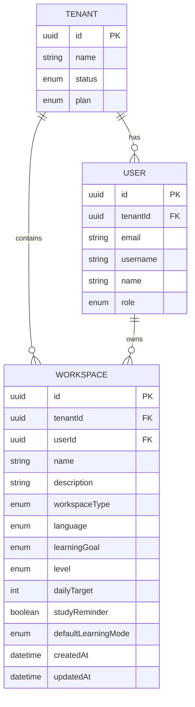

# Data Model: Workspace Onboarding

**Feature**: 003-workspace-onboarding  
**Date**: 2026-02-08

---

## Domain Entities

### Workspace (AggregateRoot)

The core entity representing a user's learning environment.

```typescript
// Domain Entity: Workspace
interface WorkspaceProps {
  tenantId: string;           // Required, links to tenant
  userId: string;             // Required, owner of workspace
  name: string;               // Required, 1-100 chars, unique per user
  description?: string;       // Optional
  workspaceType: WorkspaceType;
  language: Language;
  learningGoal: LearningGoal;
  level: Level;
  dailyTarget: number;        // 1-100
  studyReminder: boolean;
  defaultLearningMode: LearningMode;
}

enum WorkspaceType {
  PERSONAL = 'PERSONAL',
  TEAM = 'TEAM',
  CLASSROOM = 'CLASSROOM'
}

enum Language {
  EN = 'EN',
  VI = 'VI',
  ES = 'ES',
  FR = 'FR',
  DE = 'DE',
  JA = 'JA',
  KO = 'KO',
  ZH = 'ZH'
}

enum LearningGoal {
  VOCABULARY = 'VOCABULARY',
  EXAM_PREP = 'EXAM_PREP',
  DAILY_PRACTICE = 'DAILY_PRACTICE'
}

enum Level {
  BEGINNER = 'BEGINNER',
  INTERMEDIATE = 'INTERMEDIATE',
  ADVANCED = 'ADVANCED'
}

enum LearningMode {
  FLASHCARD = 'FLASHCARD',
  QUIZ = 'QUIZ',
  SPACED_REPETITION = 'SPACED_REPETITION'
}
```

### Relationships



---

## Validation Rules

| Field | Rule | Error Message |
|-------|------|---------------|
| name | Required, 1-100 chars | "Workspace name is required" / "Name must be 100 characters or less" |
| name | Unique per userId | "You already have a workspace with this name" |
| language | Required, valid enum | "Please select a language" |
| dailyTarget | Required, 1-100 | "Daily target must be between 1 and 100" |
| workspaceType | Valid enum, default PERSONAL | N/A (has default) |
| learningGoal | Valid enum, default VOCABULARY | N/A (has default) |
| level | Valid enum, default BEGINNER | N/A (has default) |
| studyReminder | Boolean, default false | N/A (has default) |
| defaultLearningMode | Valid enum, default FLASHCARD | N/A (has default) |

---

## State Transitions

Workspace has no complex state machine for MVP. States are implicit:
- **Created**: Workspace exists and is active
- **Future**: May add ARCHIVED state in later phases

---

## Database Schema (MikroORM)

```typescript
// infrastructure/persistence/workspace.orm-entity.ts
@Entity({ tableName: 'workspaces' })
export class WorkspaceOrmEntity {
  @PrimaryKey({ type: 'uuid' })
  id!: string;

  @Property({ type: 'uuid' })
  @Index()
  tenantId!: string;

  @Property({ type: 'uuid' })
  @Index()
  userId!: string;

  @Property({ length: 100 })
  name!: string;

  @Property({ nullable: true, type: 'text' })
  description?: string;

  @Enum(() => WorkspaceType)
  workspaceType!: WorkspaceType;

  @Enum(() => Language)
  language!: Language;

  @Enum(() => LearningGoal)
  learningGoal!: LearningGoal;

  @Enum(() => Level)
  level!: Level;

  @Property({ type: 'smallint' })
  dailyTarget!: number;

  @Property({ type: 'boolean' })
  studyReminder!: boolean;

  @Enum(() => LearningMode)
  defaultLearningMode!: LearningMode;

  @Property()
  createdAt!: Date;

  @Property({ onUpdate: () => new Date() })
  updatedAt!: Date;

  // Unique constraint: (tenantId, userId, name)
  @Unique({ properties: ['userId', 'name'] })
}
```

---

## Indexes

| Index | Columns | Purpose |
|-------|---------|---------|
| `idx_workspace_tenant` | tenantId | Tenant scoping for all queries |
| `idx_workspace_user` | userId | User's workspaces lookup |
| `uq_workspace_user_name` | userId, name | Unique name per user constraint |
