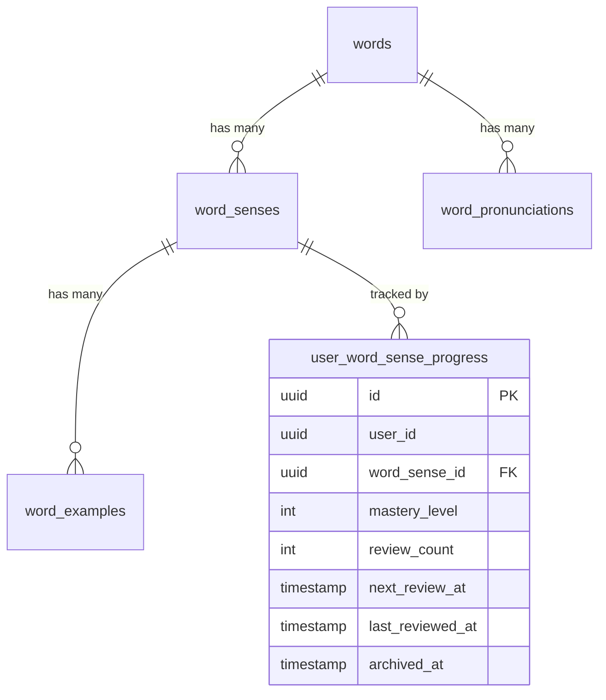

# Data Model: WordSense Learning

**Date**: 2026-03-06  
**Branch**: `005-wordsense-learning`

---

## Existing Entities (Dictionary — read-only)

### `words` table

| Column | Type | Constraints | Notes |
|--------|------|-------------|-------|
| `id` | `uuid` | PK, default `gen_random_uuid()` | |
| `text` | `varchar` | NOT NULL | Original casing |
| `normalized_text` | `varchar` | NOT NULL, UNIQUE, INDEXED | Lowercase, for search |
| `language` | `varchar` | NOT NULL | e.g. "en" |
| `rank` | `integer` | nullable | Word frequency rank |
| `frequency` | `float` | nullable | Usage frequency |
| `source` | `varchar` | NOT NULL | e.g. "azvocab" |
| `inflects` | `jsonb` | nullable | Inflection data |
| `word_family` | `varchar` | nullable | Word family group |
| `created_at` | `timestamp` | NOT NULL | |
| `updated_at` | `timestamp` | NOT NULL | |

### `word_senses` table

| Column | Type | Constraints | Notes |
|--------|------|-------------|-------|
| `id` | `uuid` | PK, default `gen_random_uuid()` | Referenced by learning |
| `word_id` | `uuid` | FK → words.id, NOT NULL | |
| `part_of_speech` | `varchar` | NOT NULL | e.g. "noun", "verb" |
| `definition` | `text` | NOT NULL | Full definition |
| `short_definition` | `varchar` | nullable | Brief definition |
| `cefr_level` | `varchar` | nullable | e.g. "A1", "B2" |
| `synonyms` | `jsonb` | nullable | Array of strings |
| `antonyms` | `jsonb` | nullable | Array of strings |
| `collocations` | `jsonb` | nullable | |
| `related_words` | `jsonb` | nullable | |
| `idioms` | `jsonb` | nullable | |
| `phrases` | `jsonb` | nullable | |
| `images` | `jsonb` | nullable | |
| `definition_vi` | `text` | nullable | Vietnamese translation |
| `order` | `integer` | NOT NULL | Display order |

---

## New Entity (Learning domain)

### `user_word_sense_progress` table

| Column | Type | Constraints | Notes |
|--------|------|-------------|-------|
| `id` | `uuid` | PK, default `gen_random_uuid()` | |
| `user_id` | `uuid` | NOT NULL, INDEXED | From JWT `userId` |
| `word_sense_id` | `uuid` | FK → word_senses.id, NOT NULL | Cross-BC reference |
| `mastery_level` | `integer` | NOT NULL, DEFAULT 0 | 0 = beginner |
| `review_count` | `integer` | NOT NULL, DEFAULT 0 | Times reviewed |
| `next_review_at` | `timestamp` | NOT NULL, DEFAULT NOW() | Spaced repetition |
| `last_reviewed_at` | `timestamp` | nullable | Last review time |
| `archived_at` | `timestamp` | nullable | Soft delete timestamp |
| `created_at` | `timestamp` | NOT NULL | |
| `updated_at` | `timestamp` | NOT NULL | |

**Indexes**:
- `UNIQUE(user_id, word_sense_id)` — Prevents duplicate entries idempotently
- `INDEX(user_id, archived_at)` — Fast queries for active learning list
- `INDEX(word_sense_id)` — FK lookup

**State Transitions**:

```
[Not Existing] --Add to Learning--> [Active] (archived_at = NULL)
[Active]       --Remove-----------> [Archived] (archived_at = NOW())
[Archived]     --Re-add-----------> [Active] (archived_at = NULL, preserve progress)
```

---

## Relationships



---

## Validation Rules

| Field | Rule | Source |
|-------|------|--------|
| `user_id` | Must be valid UUID from authenticated user | FR-006 |
| `word_sense_id` | Must reference existing `word_senses.id` | FR-006 |
| `mastery_level` | Integer, >= 0 | FR-008 |
| `review_count` | Integer, >= 0 | FR-008 |
| Unique combo | One active record per `(user_id, word_sense_id)` | FR-007 |
