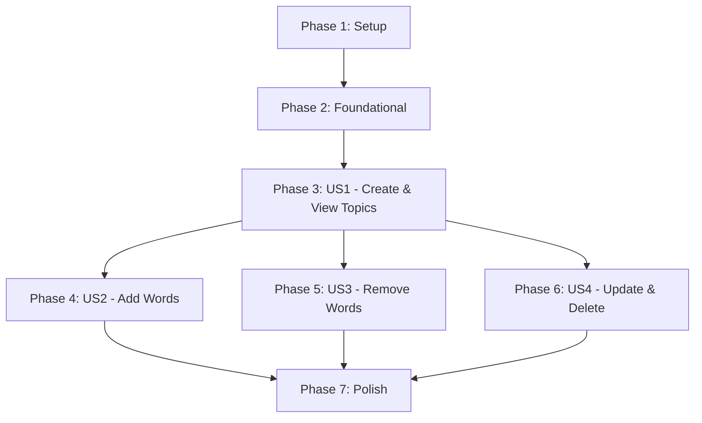

# Implementation Tasks: Topic Feature

## Dependency Graph

## Implementation Strategy
We will deliver this feature incrementally. 
- **MVP**: The ability to create topics, list topics, and view the empty detail page (Phase 1-3).
- **V1**: Adding and removing words (Phase 4-5).
- **V2**: Updating and deleting topics (Phase 6).

---

## Phase 1: Setup
**Goal**: Initialize the project structure and database entities.

- [x] T001 Register TopicController in `server/src/modules/learning/learning.module.ts`
- [x] T002 Create Topic entity in `server/src/modules/learning/domain/entities/topic.entity.ts`
- [x] T003 Create TopicWord entity in `server/src/modules/learning/domain/entities/topic-word.entity.ts`
- [x] T004 Create and run database migrations for Topic and TopicWord entities
- [x] T005 [P] Setup frontend module structure in `client/src/modules/learning/topic/` (index, components, pages, hooks, services, stores, types)

## Phase 2: Foundational
**Goal**: Core controllers and shared contracts.

- [x] T006 Initialize `TopicController` in `server/src/modules/learning/controllers/topic.controller.ts`
- [x] T007 [P] Create DTOs (TopicDto, TopicWordDto, Paginated Responses) in `server/src/modules/learning/dto/`
- [x] T008 [P] Setup frontend API service in `client/src/modules/learning/topic/services/topic.api.ts`

## Phase 3: [US1] Create, List, and View Topics (Priority: P1)
**Goal**: Enable users to create topics, list them, and view their metadata alongside a paginated words list.
**Independent Test**: Create a new topic with name/description and verify it appears in the list.

- [x] T009 [US1] Implement `CreateTopicCommand` and `CreateTopicHandler` (with max 50 topics limit check) in `server/src/modules/learning/application/commands/`
- [x] T010 [P] [US1] Implement `ListTopicsQuery` and `ListTopicsHandler` in `server/src/modules/learning/application/queries/`
- [x] T011 [P] [US1] Implement `GetTopicDetailQuery` and `GetTopicDetailHandler` in `server/src/modules/learning/application/queries/`
- [x] T012 [P] [US1] Implement `ListTopicWordsQuery` and `ListTopicWordsHandler` in `server/src/modules/learning/application/queries/`
- [x] T013 [US1] Add POST `/api/v1/topics` and GET `/api/v1/topics` endpoints in `TopicController`
- [x] T014 [US1] Add GET `/api/v1/topics/:id` and GET `/api/v1/topics/:id/words` endpoints in `TopicController`
- [x] T015 [P] [US1] Implement frontend TanStack Query hooks (`useCreateTopicMutation`, `useTopicsQuery`, `useTopicDetailQuery`, `useTopicWordsQuery`) in `client/src/modules/learning/topic/hooks/`
- [x] T016 [P] [US1] Create Zustand store `useTopicsStore` in `client/src/modules/learning/topic/stores/use-topic-store.ts` for modal state
- [x] T017 [US1] Implement `TopicsPage` and `CreateTopicDialog` components in `client/src/modules/learning/topic/`
- [x] T018 [US1] Implement `TopicDetailPage` and `TopicWordList` components in `client/src/modules/learning/topic/` and register routes

## Phase 4: [US2] Add Words to Topics (Priority: P1)
**Goal**: Allow users to add specific word senses to their topics.
**Independent Test**: Take a dictionary word sense and add it to an existing topic, verify it appears in the list.

- [x] T019 [US2] Implement `AddTopicWordCommand` and `AddTopicWordHandler` (limit 200, check duplicates, initial status NEW) in `server/src/modules/learning/application/commands/`
- [x] T020 [US2] Add POST `/api/v1/topics/:id/words` endpoint in `TopicController`
- [x] T021 [P] [US2] Implement frontend hook `useAddTopicWordMutation` in `client/src/modules/learning/topic/hooks/`
- [x] T022 [US2] Add UI logic to add words to a topic and integrate with mutation (e.g., search or add button) in `client/src/modules/learning/topic/components/`

## Phase 5: [US3] Remove Words from Topics (Priority: P2)
**Goal**: Allow users to remove words from topics.
**Independent Test**: Remove an existing word from a topic and verify it disappears.

- [x] T023 [US3] Implement `RemoveTopicWordCommand` and `RemoveTopicWordHandler` in `server/src/modules/learning/application/commands/`
- [x] T024 [US3] Add DELETE `/api/v1/topics/:topicId/words/:wordSenseId` endpoint in `TopicController`
- [x] T025 [P] [US3] Implement frontend hook `useRemoveTopicWordMutation` in `client/src/modules/learning/topic/hooks/`
- [x] T026 [US3] Add remove action button to `TopicWordList` rows and integrate mutation in `client/src/modules/learning/topic/components/`

## Phase 6: [US4] Update and Delete Topics (Priority: P2)
**Goal**: Provide management capabilities for existing topics.
**Independent Test**: Edit a topic name, then delete the topic. Verify backend constraints.

- [x] T027 [US4] Implement `UpdateTopicCommand` and `UpdateTopicHandler` in `server/src/modules/learning/application/commands/`
- [x] T028 [P] [US4] Implement `DeleteTopicCommand` and `DeleteTopicHandler` (ensure cascade deletion) in `server/src/modules/learning/application/commands/`
- [x] T029 [US4] Add PUT `/api/v1/topics/:id` and DELETE `/api/v1/topics/:id` endpoints in `TopicController`
- [x] T030 [P] [US4] Implement frontend hooks `useUpdateTopicMutation` and `useDeleteTopicMutation` in `client/src/modules/learning/topic/hooks/`
- [x] T031 [US4] Implement `UpdateTopicDialog` component in `client/src/modules/learning/topic/components/`
- [x] T032 [US4] Add Edit/Delete actions in `TopicsPage` and `TopicDetailPage` and integrate mutations

## Phase 7: Polish & Cross-Cutting
**Goal**: Finalize UX, error handling, and performance.

- [x] T033 Enhance error handling for domain limits (e.g., max 50 topics user facing toast notifications)
- [x] T034 Implement skeleton loaders for `TopicList` and `TopicWordList` while fetching
- [x] T035 Ensure all responsive design requirements are met across topic feature UI
