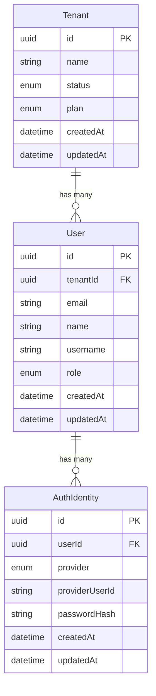

# Data Model: Local Auth Register

**Feature**: 1-local-auth-register  
**Date**: 2026-02-01

---

## Entity Overview



---

## Tenant Entity

### Purpose
Represents a workspace/organization. Created automatically during registration.

### Fields

| Field | Type | Constraints | Description |
|-------|------|-------------|-------------|
| `id` | UUID | PK, auto-generated | Unique identifier |
| `name` | string | NOT NULL, max 100 chars | Workspace name |
| `status` | enum | NOT NULL, default 'ACTIVE' | Tenant status |
| `plan` | enum | NOT NULL, default 'FREE' | Subscription plan |
| `createdAt` | datetime | NOT NULL, auto | Creation timestamp |
| `updatedAt` | datetime | NOT NULL, auto | Last update timestamp |

### Enums

**TenantStatus**:
- `ACTIVE` - Normal operation
- `SUSPENDED` - Temporarily disabled
- `DELETED` - Soft deleted

**TenantPlan**:
- `FREE` - Free tier
- `PRO` - Professional tier
- `ENTERPRISE` - Enterprise tier

### Business Rules
- Name defaults to "[User Name]'s Workspace" if not provided
- Status defaults to ACTIVE on creation
- Plan defaults to FREE on creation

---

## User Entity

### Purpose
Represents a human user account. Created during registration and linked to tenant.

### Fields

| Field | Type | Constraints | Description |
|-------|------|-------------|-------------|
| `id` | UUID | PK, auto-generated | Unique identifier |
| `tenantId` | UUID | FK to Tenant, NOT NULL | Tenant this user belongs to |
| `email` | string | NOT NULL, max 255 chars | User's email address |
| `name` | string | NOT NULL, max 100 chars | User's display name |
| `username` | string | UNIQUE, NOT NULL, max 50 chars | Auto-generated username |
| `role` | enum | NOT NULL | User's role in tenant |
| `createdAt` | datetime | NOT NULL, auto | Creation timestamp |
| `updatedAt` | datetime | NOT NULL, auto | Last update timestamp |

### Enums

**UserRole**:
- `ADMIN` - Full access, tenant owner
- `MEMBER` - Regular user
- `VIEWER` - Read-only access

### Indexes
- `idx_user_tenant_id` on `tenantId`
- `idx_user_email` on `email`
- `unique_user_username` on `username`

### Business Rules
- Username is auto-generated from email prefix + random suffix
- First user of a tenant gets ADMIN role
- Email is NOT unique globally (can exist in multiple tenants)

---

## AuthIdentity Entity

### Purpose
Represents a login method for a user. Supports multiple auth providers.

### Fields

| Field | Type | Constraints | Description |
|-------|------|-------------|-------------|
| `id` | UUID | PK, auto-generated | Unique identifier |
| `userId` | UUID | FK to User, NOT NULL | User this identity belongs to |
| `provider` | enum | NOT NULL | Authentication provider |
| `providerUserId` | string | NOT NULL, max 255 chars | Provider-specific user ID (email for LOCAL) |
| `passwordHash` | string | NULLABLE, max 255 chars | Hashed password (only for LOCAL) |
| `createdAt` | datetime | NOT NULL, auto | Creation timestamp |
| `updatedAt` | datetime | NOT NULL, auto | Last update timestamp |

### Enums

**AuthProvider**:
- `LOCAL` - Email/password authentication
- `GOOGLE` - Google OAuth (future)
- `GITHUB` - GitHub OAuth (future)

### Indexes
- `idx_auth_identity_user_id` on `userId`
- `unique_auth_identity_provider_user` on `(provider, providerUserId)`

### Business Rules
- Unique constraint on (provider, providerUserId) allows same email for different providers
- passwordHash is required for LOCAL provider, NULL for OAuth providers
- passwordHash uses bcrypt format (includes salt and cost)

---

## Validation Rules

### Email
- Must be valid RFC 5322 format
- Max 255 characters
- Case-insensitive comparison

### Password
- Minimum 8 characters
- At least 1 uppercase letter
- At least 1 lowercase letter
- At least 1 digit
- Max 128 characters

### Name
- Required (not empty)
- Max 100 characters
- Trimmed whitespace

### Username
- Auto-generated (not user input)
- Pattern: `[a-z0-9._]+_[a-z0-9]{4}`
- Max 50 characters
- Globally unique

### Tenant Name
- Optional (defaults to "[Name]'s Workspace")
- Max 100 characters

---

## Database Schema (PostgreSQL)

```sql
-- Tenant table
CREATE TABLE tenants (
    id UUID PRIMARY KEY DEFAULT gen_random_uuid(),
    name VARCHAR(100) NOT NULL,
    status VARCHAR(20) NOT NULL DEFAULT 'ACTIVE',
    plan VARCHAR(20) NOT NULL DEFAULT 'FREE',
    created_at TIMESTAMP NOT NULL DEFAULT NOW(),
    updated_at TIMESTAMP NOT NULL DEFAULT NOW()
);

-- User table
CREATE TABLE users (
    id UUID PRIMARY KEY DEFAULT gen_random_uuid(),
    tenant_id UUID NOT NULL REFERENCES tenants(id),
    email VARCHAR(255) NOT NULL,
    name VARCHAR(100) NOT NULL,
    username VARCHAR(50) NOT NULL UNIQUE,
    role VARCHAR(20) NOT NULL DEFAULT 'MEMBER',
    created_at TIMESTAMP NOT NULL DEFAULT NOW(),
    updated_at TIMESTAMP NOT NULL DEFAULT NOW()
);

CREATE INDEX idx_users_tenant_id ON users(tenant_id);
CREATE INDEX idx_users_email ON users(email);

-- AuthIdentity table
CREATE TABLE auth_identities (
    id UUID PRIMARY KEY DEFAULT gen_random_uuid(),
    user_id UUID NOT NULL REFERENCES users(id),
    provider VARCHAR(20) NOT NULL,
    provider_user_id VARCHAR(255) NOT NULL,
    password_hash VARCHAR(255),
    created_at TIMESTAMP NOT NULL DEFAULT NOW(),
    updated_at TIMESTAMP NOT NULL DEFAULT NOW(),
    UNIQUE(provider, provider_user_id)
);

CREATE INDEX idx_auth_identities_user_id ON auth_identities(user_id);
```
