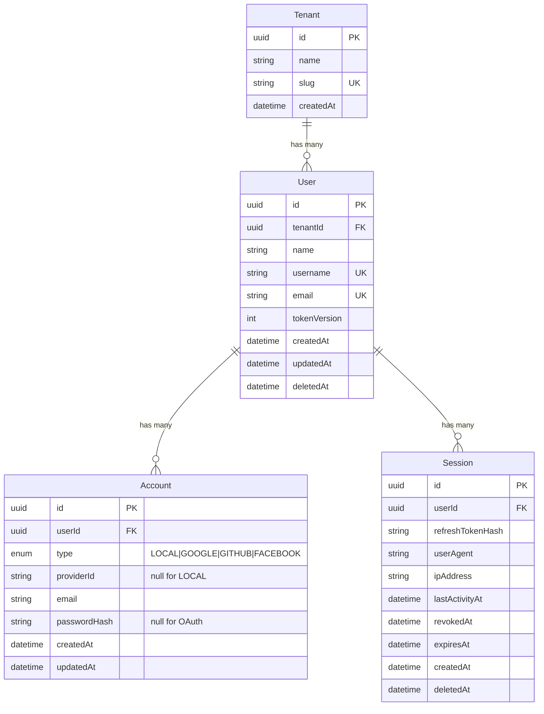
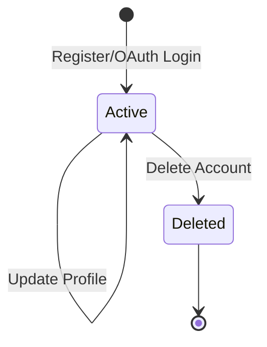
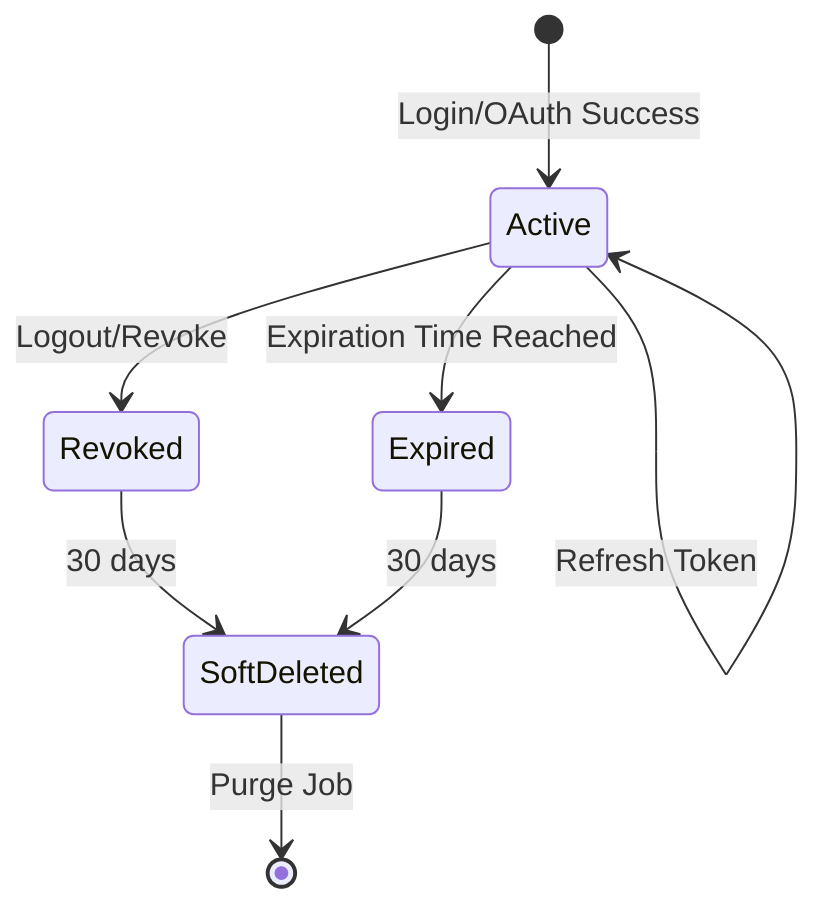

# Data Model: NestJS Authentication System

**Feature**: 1-nestjs-auth  
**Date**: 2026-01-19

---

## Entity Relationship Diagram



---

## Entities

### User

The core identity entity representing a person in the system.

| Field | Type | Constraints | Description |
|-------|------|-------------|-------------|
| `id` | UUID | PK | Unique identifier |
| `tenantId` | UUID | FK → Tenant.id, NOT NULL | Owning tenant (for multi-tenancy) |
| `name` | VARCHAR(100) | NOT NULL | Display name |
| `username` | VARCHAR(50) | UNIQUE, NOT NULL | Auto-generated login identifier |
| `email` | VARCHAR(255) | UNIQUE, NOT NULL | Primary email (from first auth method) |
| `tokenVersion` | INT | NOT NULL, DEFAULT 0 | Incremented on password change for global token invalidation |
| `createdAt` | TIMESTAMP | NOT NULL | Creation timestamp |
| `updatedAt` | TIMESTAMP | NOT NULL | Last update timestamp |
| `deletedAt` | TIMESTAMP | NULLABLE | Soft delete timestamp |

**Indexes**:
- `idx_user_tenant` on `tenantId`
- `idx_user_email` on `email`
- `idx_user_username` on `username`

**Business Rules**:
- Each User MUST belong to exactly one Tenant
- Username is auto-generated from name during registration
- Username format: lowercase alphanumeric, 3-50 characters
- tokenVersion is incremented when password changes or "logout all" is triggered
- User cannot be deleted if it has any active Accounts (soft-delete only)
- All User queries MUST filter by tenantId for data isolation

---

### Account

Represents an authentication method linked to a User.

| Field | Type | Constraints | Description |
|-------|------|-------------|-------------|
| `id` | UUID | PK | Unique identifier |
| `userId` | UUID | FK → User.id, NOT NULL | Owning user |
| `type` | ENUM | NOT NULL | `LOCAL`, `GOOGLE`, `GITHUB`, `FACEBOOK` |
| `providerId` | VARCHAR(255) | NULLABLE | External provider's user ID (null for LOCAL) |
| `email` | VARCHAR(255) | NOT NULL | Email associated with this auth method |
| `passwordHash` | VARCHAR(60) | NULLABLE | bcrypt hash (null for OAuth accounts) |
| `createdAt` | TIMESTAMP | NOT NULL | Creation timestamp |
| `updatedAt` | TIMESTAMP | NOT NULL | Last update timestamp |

**Indexes**:
- `idx_account_user_type` on `(userId, type)` - UNIQUE
- `idx_account_type_provider` on `(type, providerId)` - UNIQUE WHERE providerId IS NOT NULL
- `idx_account_type_email` on `(type, email)` - for lookup during OAuth

**Business Rules**:
- Each User can have at most one Account per type
- LOCAL accounts MUST have passwordHash
- OAuth accounts MUST have providerId, MUST NOT have passwordHash
- Cannot unlink the last Account from a User
- Password requirements: min 8 chars + 1 number + 1 special character

---

### Session

Represents an active login session.

| Field | Type | Constraints | Description |
|-------|------|-------------|-------------|
| `id` | UUID | PK | Unique identifier (also used as JWT `jti`) |
| `userId` | UUID | FK → User.id, NOT NULL | Owning user |
| `refreshTokenHash` | VARCHAR(64) | NOT NULL | SHA-256 hash of current refresh token |
| `userAgent` | VARCHAR(500) | NULLABLE | Browser/device user agent string |
| `ipAddress` | VARCHAR(45) | NULLABLE | Client IP address (IPv4/IPv6) |
| `lastActivityAt` | TIMESTAMP | NOT NULL | Last refresh or activity |
| `expiresAt` | TIMESTAMP | NOT NULL | When refresh token expires |
| `revokedAt` | TIMESTAMP | NULLABLE | When session was revoked |
| `createdAt` | TIMESTAMP | NOT NULL | Creation timestamp |
| `deletedAt` | TIMESTAMP | NULLABLE | Soft delete (30 days after revoke/expire) |

**Indexes**:
- `idx_session_user_active` on `(userId, revokedAt, deletedAt)` - for active session queries
- `idx_session_expires` on `expiresAt` - for cleanup jobs

**Business Rules**:
- refreshTokenHash is SHA-256 of the actual refresh token
- On token rotation: update refreshTokenHash and lastActivityAt
- Token reuse detection: if refresh request token doesn't match stored hash → REVOKE ALL
- Sessions are soft-deleted after 30 days for audit trail
- revokedAt is set on logout or explicit revocation

---

## Enums

### AccountType

```typescript
enum AccountType {
  LOCAL = 'LOCAL',
  GOOGLE = 'GOOGLE',
  GITHUB = 'GITHUB',
  FACEBOOK = 'FACEBOOK'
}
```

### TokenType (for JWT service)

```typescript
enum TokenType {
  ACCESS = 'ACCESS',
  REFRESH = 'REFRESH'
}
```

---

## State Transitions

### User Lifecycle



### Session Lifecycle



---

## Validation Rules

### User

| Field | Validation |
|-------|------------|
| `name` | 2-100 characters, allows unicode letters, spaces, apostrophes, hyphens |
| `username` | 3-50 characters, lowercase alphanumeric only |
| `email` | Valid email format, max 255 characters |

### Account

| Field | Validation |
|-------|------------|
| `type` | Must be valid AccountType enum |
| `email` | Valid email format |
| `passwordHash` | Required if type=LOCAL, 60 chars (bcrypt format) |
| `providerId` | Required if type≠LOCAL, max 255 chars |

### Password (pre-hash)

| Rule | Requirement |
|------|-------------|
| Minimum length | 8 characters |
| Numeric | At least 1 digit |
| Special | At least 1 special character (!@#$%^&*...) |

---

## Database Migrations

### Migration 001: Create Tenants Table (if not exists)

```sql
-- Note: Tenant table may already exist from tenant module
-- This migration ensures it exists for auth module FK
CREATE TABLE IF NOT EXISTS tenants (
    id UUID PRIMARY KEY DEFAULT gen_random_uuid(),
    name VARCHAR(100) NOT NULL,
    slug VARCHAR(50) NOT NULL UNIQUE,
    created_at TIMESTAMP NOT NULL DEFAULT NOW()
);

-- Insert default tenant for development
INSERT INTO tenants (id, name, slug) 
VALUES ('00000000-0000-0000-0000-000000000001', 'Default Tenant', 'default')
ON CONFLICT DO NOTHING;
```

### Migration 002: Create Users Table

```sql
CREATE TABLE users (
    id UUID PRIMARY KEY DEFAULT gen_random_uuid(),
    tenant_id UUID NOT NULL REFERENCES tenants(id),
    name VARCHAR(100) NOT NULL,
    username VARCHAR(50) NOT NULL UNIQUE,
    email VARCHAR(255) NOT NULL UNIQUE,
    token_version INT NOT NULL DEFAULT 0,
    created_at TIMESTAMP NOT NULL DEFAULT NOW(),
    updated_at TIMESTAMP NOT NULL DEFAULT NOW(),
    deleted_at TIMESTAMP
);

CREATE INDEX idx_user_tenant ON users(tenant_id);
CREATE INDEX idx_user_email ON users(email);
CREATE INDEX idx_user_username ON users(username);
```

### Migration 003: Create Accounts Table

```sql
CREATE TYPE account_type AS ENUM ('LOCAL', 'GOOGLE', 'GITHUB', 'FACEBOOK');

CREATE TABLE accounts (
    id UUID PRIMARY KEY DEFAULT gen_random_uuid(),
    user_id UUID NOT NULL REFERENCES users(id) ON DELETE CASCADE,
    type account_type NOT NULL,
    provider_id VARCHAR(255),
    email VARCHAR(255) NOT NULL,
    password_hash VARCHAR(60),
    created_at TIMESTAMP NOT NULL DEFAULT NOW(),
    updated_at TIMESTAMP NOT NULL DEFAULT NOW(),
    
    UNIQUE(user_id, type),
    CONSTRAINT chk_local_password CHECK (
        (type = 'LOCAL' AND password_hash IS NOT NULL) OR
        (type != 'LOCAL' AND password_hash IS NULL AND provider_id IS NOT NULL)
    )
);

CREATE UNIQUE INDEX idx_account_provider ON accounts(type, provider_id) 
    WHERE provider_id IS NOT NULL;
CREATE INDEX idx_account_type_email ON accounts(type, email);
```

### Migration 004: Create Sessions Table

```sql
CREATE TABLE sessions (
    id UUID PRIMARY KEY DEFAULT gen_random_uuid(),
    user_id UUID NOT NULL REFERENCES users(id) ON DELETE CASCADE,
    refresh_token_hash VARCHAR(64) NOT NULL,
    user_agent VARCHAR(500),
    ip_address VARCHAR(45),
    last_activity_at TIMESTAMP NOT NULL DEFAULT NOW(),
    expires_at TIMESTAMP NOT NULL,
    revoked_at TIMESTAMP,
    created_at TIMESTAMP NOT NULL DEFAULT NOW(),
    deleted_at TIMESTAMP
);

CREATE INDEX idx_session_user_active ON sessions(user_id, revoked_at, deleted_at);
CREATE INDEX idx_session_expires ON sessions(expires_at);
```
