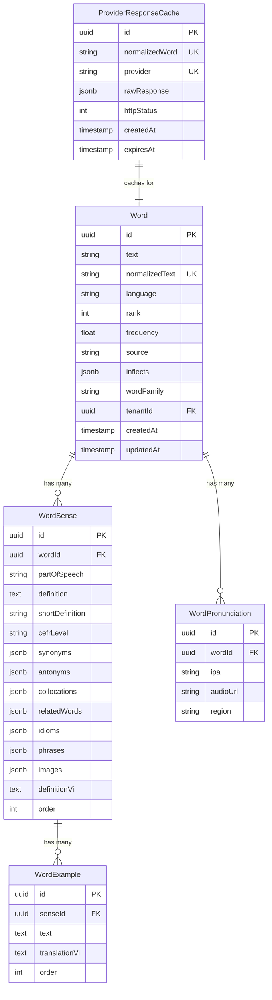

# Data Model: Dictionary Lookup Flow

**Date**: 2026-02-10 | **Plan**: [plan.md](file:///e:/Projects/multi-tenant/easy-english-v2/specs/4-dictionary-lookup/plan.md)

---

## Entity Relationship Diagram



---

## New Entity: ProviderResponseCacheEntity

### Schema

| Column | Type | Constraints | Description |
|--------|------|-------------|-------------|
| `id` | UUID | PK, DEFAULT gen_random_uuid() | Primary key |
| `normalizedWord` | VARCHAR(100) | NOT NULL, INDEX | Lowercase, trimmed word |
| `provider` | VARCHAR(50) | NOT NULL | Provider name: 'azvocab' |
| `rawResponse` | JSONB | NOT NULL | Full API response |
| `httpStatus` | INTEGER | NOT NULL | HTTP status code |
| `createdAt` | TIMESTAMPTZ | NOT NULL, DEFAULT NOW() | Cache creation time |
| `expiresAt` | TIMESTAMPTZ | NOT NULL | Cache expiration time |

### Constraints

```sql
-- Unique constraint for cache lookup
UNIQUE (normalized_word, provider)

-- Index for expiration cleanup
INDEX idx_provider_cache_expires_at ON provider_response_cache(expires_at)
```

### MikroORM Entity

```typescript
@Entity({ tableName: 'provider_response_cache' })
export class ProviderResponseCacheOrmEntity {
  @PrimaryKey({ type: 'uuid', defaultRaw: 'gen_random_uuid()' })
  id!: string;

  @Property({ length: 100 })
  @Index()
  normalizedWord!: string;

  @Property({ length: 50 })
  provider!: string;

  @Property({ type: 'jsonb' })
  rawResponse!: Record<string, unknown>;

  @Property()
  httpStatus!: number;

  @Property()
  createdAt: Date = new Date();

  @Property()
  @Index()
  expiresAt!: Date;

  @Unique({ properties: ['normalizedWord', 'provider'] })
  uniqueWordProvider!: string;
}
```

---

## Value Object: WordSnapshot

Read-only projection for API responses.

```typescript
export class WordSnapshot extends ValueObject<WordSnapshotProps> {
  get text(): string { return this.props.text; }
  get normalizedText(): string { return this.props.normalizedText; }
  get language(): string { return this.props.language; }
  get pronunciations(): PronunciationVO[] { return this.props.pronunciations; }
  get senses(): SenseVO[] { return this.props.senses; }
  get source(): 'internal' | 'azvocab' { return this.props.source; }
  get rank(): number | null { return this.props.rank; }
  get frequency(): number | null { return this.props.frequency; }

  static create(props: WordSnapshotProps): WordSnapshot {
    return new WordSnapshot(props);
  }
}

interface WordSnapshotProps {
  text: string;
  normalizedText: string;
  language: string;
  pronunciations: PronunciationVO[];
  senses: SenseVO[];
  source: 'internal' | 'azvocab';
  rank: number | null;
  frequency: number | null;
}
```

---

## Value Object: PronunciationVO

```typescript
export class PronunciationVO extends ValueObject<PronunciationProps> {
  get ipa(): string { return this.props.ipa; }
  get audioUrl(): string | null { return this.props.audioUrl; }
  get region(): string { return this.props.region; }
}
```

---

## Value Object: SenseVO

```typescript
export class SenseVO extends ValueObject<SenseProps> {
  get partOfSpeech(): string { return this.props.partOfSpeech; }
  get definition(): string { return this.props.definition; }
  get shortDefinition(): string | null { return this.props.shortDefinition; }
  get cefrLevel(): string | null { return this.props.cefrLevel; }
  get examples(): ExampleVO[] { return this.props.examples; }
  get synonyms(): string[] { return this.props.synonyms; }
  get antonyms(): string[] { return this.props.antonyms; }
  get definitionVi(): string | null { return this.props.definitionVi; }
}
```

---

## Validation Rules

| Field | Rule |
|-------|------|
| `word.text` | Required, 1-100 characters |
| `word.normalizedText` | Lowercase, trimmed, no special characters |
| `word.language` | ISO 639-1 code (e.g., 'en', 'vi') |
| `cache.provider` | Enum: 'azvocab' (Phase 1) |
| `cache.httpStatus` | Valid HTTP status code |

---

## Migration SQL

```sql
-- Migration: Create provider_response_cache table
CREATE TABLE IF NOT EXISTS provider_response_cache (
    id UUID PRIMARY KEY DEFAULT gen_random_uuid(),
    normalized_word VARCHAR(100) NOT NULL,
    provider VARCHAR(50) NOT NULL,
    raw_response JSONB NOT NULL,
    http_status INTEGER NOT NULL,
    created_at TIMESTAMPTZ NOT NULL DEFAULT NOW(),
    expires_at TIMESTAMPTZ NOT NULL,
    
    CONSTRAINT uq_provider_cache_word_provider 
        UNIQUE (normalized_word, provider)
);

-- Indexes
CREATE INDEX idx_provider_cache_normalized_word 
    ON provider_response_cache(normalized_word);
    
CREATE INDEX idx_provider_cache_expires_at 
    ON provider_response_cache(expires_at);

-- Comment
COMMENT ON TABLE provider_response_cache IS 
    'Caches raw API responses from external dictionary providers';
```
