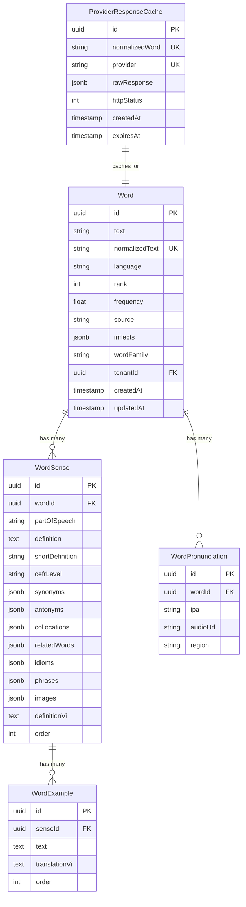

# Data Model: Dictionary Lookup Flow

**Date**: 2026-02-10 | **Plan**: [plan.md](file:///e:/Projects/multi-tenant/easy-english-v2/specs/4-dictionary-lookup/plan.md)

---

## Entity Relationship Diagram



---

## New Entity: ProviderResponseCacheEntity

### Schema

| Column | Type | Constraints | Description |
|--------|------|-------------|-------------|
| `id` | UUID | PK, DEFAULT gen_random_uuid() | Primary key |
| `normalizedWord` | VARCHAR(100) | NOT NULL, INDEX | Lowercase word or defId (for definition cache) |
| `provider` | VARCHAR(50) | NOT NULL | Provider name: `'azvocab'` (word-level) or `'azvocab-definition'` (def-level) |
| `rawResponse` | JSONB | NOT NULL | Full API response |
| `httpStatus` | INTEGER | NOT NULL | HTTP status code |
| `createdAt` | TIMESTAMPTZ | NOT NULL, DEFAULT NOW() | Cache creation time |
| `expiresAt` | TIMESTAMPTZ | NOT NULL | Cache expiration time |

### Constraints

```sql
-- Unique constraint for cache lookup
UNIQUE (normalized_word, provider)

-- Index for expiration cleanup
INDEX idx_provider_cache_expires_at ON provider_response_cache(expires_at)
```

### MikroORM Entity

```typescript
@Entity({ tableName: 'provider_response_cache' })
export class ProviderResponseCacheOrmEntity {
  @PrimaryKey({ type: 'uuid', defaultRaw: 'gen_random_uuid()' })
  id!: string;

  @Property({ length: 100 })
  @Index()
  normalizedWord!: string;

  @Property({ length: 50 })
  provider!: string;

  @Property({ type: 'jsonb' })
  rawResponse!: Record<string, unknown>;

  @Property()
  httpStatus!: number;

  @Property()
  createdAt: Date = new Date();

  @Property()
  @Index()
  expiresAt!: Date;

  @Unique({ properties: ['normalizedWord', 'provider'] })
  uniqueWordProvider!: string;
}
```

---

## Domain Primitives (Value Objects)

To enforce Domain-Driven Design (DDD) principles and type safety, we use the following domain primitives:

- `WordId`: Encapsulates a UUID v7 identifier for strongly-typed word IDs.
- `WordText`: Encapsulates word text, handling normalization and trimming.
- `Language`: Language code identifier with predefined constants (e.g., `Language.ENGLISH`).
- `DataSource`: Tracks the origin of the word data (`DataSource.INTERNAL`, `DataSource.AZVOCAB`).
- `CefrLevel`: Validates CEFR levels (`A1` through `C2`).
- `PartOfSpeech`: Encapsulates valid grammatical parts of speech.

---

## Aggregate Root: Word

The `Word` entity serves as an Aggregate Root, encapsulating properties previously held in `WordSnapshot`, the `WordId`, and tracking versioning/events.

```typescript
export class Word extends AggregateRoot {
  get wordId(): WordId;
  get text(): WordText;
  get normalizedText(): WordText;
  get language(): Language;
  get source(): DataSource;
  get rank(): number | null;
  get frequency(): number | null;
  get pronunciations(): PronunciationVO[];
  get senses(): SenseVO[];
  get version(): number;
  
  static createFromProvider(props: { wordProps: WordProps, tenantId: string }): Word;
  static rehydrate(props: { id: string, wordProps: WordProps, version: number, createdAt: Date, updatedAt: Date }): Word;
  
  updateFromProvider(props: WordProps, tenantId: string): void;
}
```

---

## Interface: WordProps

Used as a flat property transfer object for mapper and factory inputs. Now utilizes domain primitives.

```typescript
export interface WordProps {
  text: WordText;
  normalizedText: WordText;
  language: Language;
  source: DataSource;
  rank: number | null;
  frequency: number | null;
  pronunciations: PronunciationVO[];
  senses: SenseVO[];
}
```

---

## Value Object: PronunciationVO

```typescript
export class PronunciationVO extends ValueObject<PronunciationProps> {
  get ipa(): string { return this.props.ipa; }
  get audioUrl(): string | null { return this.props.audioUrl; }
  get region(): string { return this.props.region; }
}
```

---

## Value Object: SenseVO

```typescript
export class SenseVO extends ValueObject<SenseProps> {
  get partOfSpeech(): PartOfSpeech;
  get definition(): string;
  get shortDefinition(): string | null;
  get cefrLevel(): CefrLevel | null;
  get examples(): ExampleVO[];
  get synonyms(): string[];
  get antonyms(): string[];
  get definitionVi(): string | null;
}
```

---

## Validation Rules

| Field | Rule |
|-------|------|
| `word.text` | Required, 1-100 characters |
| `word.normalizedText` | Lowercase, trimmed, no special characters |
| `word.language` | ISO 639-1 code (e.g., 'en', 'vi') |
| `cache.provider` | Enum: `'azvocab'`, `'azvocab-definition'` (Phase 1) |
| `cache.httpStatus` | Valid HTTP status code |

---

## Migration SQL

```sql
-- Migration: Create provider_response_cache table
CREATE TABLE IF NOT EXISTS provider_response_cache (
    id UUID PRIMARY KEY DEFAULT gen_random_uuid(),
    normalized_word VARCHAR(100) NOT NULL,
    provider VARCHAR(50) NOT NULL,
    raw_response JSONB NOT NULL,
    http_status INTEGER NOT NULL,
    created_at TIMESTAMPTZ NOT NULL DEFAULT NOW(),
    expires_at TIMESTAMPTZ NOT NULL,
    
    CONSTRAINT uq_provider_cache_word_provider 
        UNIQUE (normalized_word, provider)
);

-- Indexes
CREATE INDEX idx_provider_cache_normalized_word 
    ON provider_response_cache(normalized_word);
    
CREATE INDEX idx_provider_cache_expires_at 
    ON provider_response_cache(expires_at);

-- Comment
COMMENT ON TABLE provider_response_cache IS 
    'Caches raw API responses from external dictionary providers';
```

### Cache Record Examples

| `normalized_word` | `provider` | `raw_response` (summary) | `expires_at` |
|---|---|---|---|
| `hello` | `azvocab` | Full search + definitions JSON | +90 days |
| `abc-uuid-1` | `azvocab-definition` | Single definition JSON | +30 days |
| `def-uuid-2` | `azvocab-definition` | Single definition JSON | +30 days |
| `unknown_word` | `azvocab` | `{}` (404 response) | +24 hours |
