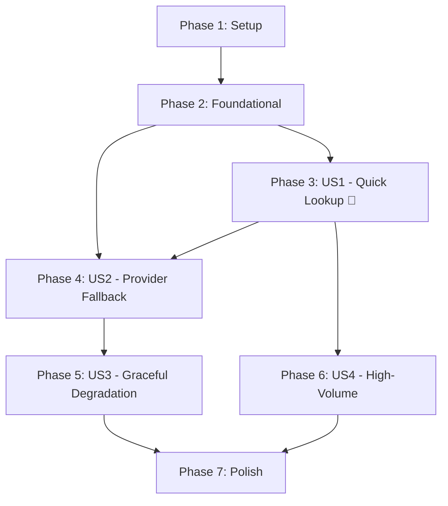

# Tasks: Dictionary Lookup Flow

**Input**: Design documents from `/specs/4-dictionary-lookup/`
**Prerequisites**: plan.md ✅, spec.md ✅, research.md ✅, data-model.md ✅, contracts/ ✅

**Tests**: Not explicitly requested — test tasks omitted. Manual verification via `quickstart.md`.

**Organization**: Tasks grouped by user story for independent implementation and testing.

## Format: `[ID] [P?] [Story] Description`

- **[P]**: Can run in parallel (different files, no dependencies)
- **[Story]**: Which user story this task belongs to (e.g., US1, US2)
- All paths relative to repo root

---

## Phase 1: Setup (Shared Infrastructure)

**Purpose**: Create dictionary module skeleton and configuration

- [x] T001 Create dictionary module directory structure: `server/src/modules/dictionary/` with subdirectories `controllers/`, `application/queries/`, `domain/value-objects/`, `domain/events/`, `domain/providers/`, `domain/repositories/`, `infrastructure/persistence/`, `infrastructure/repositories/`, `infrastructure/providers/azvocab/`, `dto/responses/`
- [x] T002 [P] Add AzVocab environment variables (`AZVOCAB_API_URL`, `AZVOCAB_API_KEY`, `AZVOCAB_TIMEOUT_MS`, `PROVIDER_CACHE_TTL_DAYS`, `PROVIDER_CACHE_404_TTL_HOURS`, `MEMORY_CACHE_TTL_SECONDS`) to `server/.env.example`
- [x] T003 [P] Create dictionary configuration with `@nestjs/config` registerAs in `server/src/configs/dictionary.config.ts`

---

## Phase 2: Foundational (Blocking Prerequisites)

**Purpose**: Domain primitives, entity, migration, and module registration that ALL user stories depend on

**⚠️ CRITICAL**: No user story work can begin until this phase is complete

- [x] T004 [P] Create `WordSnapshot` value object in `server/src/modules/dictionary/domain/value-objects/word-snapshot.vo.ts` — immutable read model with `text`, `normalizedText`, `language`, `source`, `rank`, `frequency`, `pronunciations[]`, `senses[]` (per data-model.md)
- [x] T005 [P] Create `WordPronunciationVO` value object in `server/src/modules/dictionary/domain/value-objects/word-pronunciation.vo.ts` — with `ipa`, `audioUrl`, `region`
- [x] T006 [P] Create `WordSenseVO` value object in `server/src/modules/dictionary/domain/value-objects/word-sense.vo.ts` — with `partOfSpeech`, `definition`, `shortDefinition`, `cefrLevel`, `examples[]`, `synonyms[]`, `antonyms[]`, `definitionVi`
- [x] T007 [P] Create `WordExampleVO` value object in `server/src/modules/dictionary/domain/value-objects/word-example.vo.ts` — with `text`, `translationVi`, `order`
- [x] T008 [P] Create `IWordReadRepository` interface in `server/src/modules/dictionary/domain/repositories/word-read.repository.interface.ts` — `findByWord(normalizedWord, tenantId): Promise<WordSnapshot | null>`
- [x] T009 [P] Create `ILookupProvider` interface in `server/src/modules/dictionary/domain/providers/lookup-provider.interface.ts` — `lookup(word): Promise<WordSnapshot | null>`, `isAvailable(): Promise<boolean>`, `readonly name: string`
- [x] T010 [P] Create `ProviderResponseCacheOrmEntity` in `server/src/modules/dictionary/infrastructure/persistence/provider-response-cache.orm-entity.ts` — MikroORM entity per data-model.md schema with unique `[normalizedWord, provider]` constraint
- [x] T011 [P] Create `LookupMissedEvent` in `server/src/modules/dictionary/domain/events/lookup-missed.event.ts` — domain event with `word`, `tenantId`, `userId`
- [x] T012 [P] Create `LookupSucceededEvent` in `server/src/modules/dictionary/domain/events/lookup-succeeded.event.ts` — domain event with `word`, `source`, `tenantId`, `userId`
- [x] T013 [P] Create `WordSnapshotResponseDto` in `server/src/modules/dictionary/dto/responses/word-snapshot.response.dto.ts` — DTO mapping from `WordSnapshot` VO for API output (per contracts/lookup.openapi.yaml)
- [x] T014 Create `DictionaryModule` in `server/src/modules/dictionary/dictionary.module.ts` — register all providers, handlers, repositories; import `CqrsModule`, `HttpModule`; register in `AppModule`
- [x] T015 Create database migration for `provider_response_cache` table in `server/src/database/migrations/` — per migration SQL in data-model.md

**Checkpoint**: Foundation ready — all value objects, interfaces, entity, and module registered. User story implementation can begin.

---

## Phase 3: User Story 1 — Quick Word Lookup (Priority: P1) 🎯 MVP

**Goal**: A learner looks up a common word and receives definitions, pronunciations, and examples within 1 second from internal DB or memory cache.

**Independent Test**: Enter any word pre-existing in the DB (e.g., "hello"). Verify full definition with pronunciation and examples is returned in `< 1s`.

### Implementation for User Story 1

- [x] T016 [US1] Create `WordSnapshotMapper` in `server/src/modules/dictionary/infrastructure/repositories/word-snapshot.mapper.ts` — map existing `WordOrmEntity` (with eager-loaded senses, pronunciations, examples) → `WordSnapshot` VO
- [x] T017 [US1] Implement `WordReadRepository` in `server/src/modules/dictionary/infrastructure/repositories/word-read.repository.ts` — implements `IWordReadRepository`, queries existing `WordOrmEntity` by `normalizedWord` + `tenantId`, uses eager loading, returns `WordSnapshot` via mapper
- [x] T018 [US1] Create `LookupWordQuery` in `server/src/modules/dictionary/application/queries/lookup-word.query.ts` — CQRS query class with `word`, `tenantId`, `userId`
- [x] T019 [US1] Implement `LookupWordHandler` in `server/src/modules/dictionary/application/queries/lookup-word.handler.ts` — `@QueryHandler(LookupWordQuery)`: normalize word → check NestJS `CacheManager` → query `WordReadRepository` → return `WordSnapshot` or proceed to provider layer (US2). For US1 MVP: return result or `NotFoundException`
- [x] T020 [US1] Create `LookupController` in `server/src/modules/dictionary/controllers/lookup.controller.ts` — `GET /api/v1/dictionary/lookup/:word`, JWT guard, validate word input (1-100 chars), dispatch `LookupWordQuery`, return `WordSnapshotResponseDto`
- [x] T021 [US1] Register `LookupWordHandler` and `LookupController` in `DictionaryModule` in `server/src/modules/dictionary/dictionary.module.ts`

**Checkpoint**: `GET /api/v1/dictionary/lookup/hello` returns full definition for DB-cached words. US1 is independently testable.

---

## Phase 4: User Story 2 — External Provider Fallback (Priority: P2)

**Goal**: When a word is not in the internal DB, the system fetches it from AzVocab and returns the result seamlessly to the learner.

**Independent Test**: Look up a rare word not in the DB (e.g., "defenestration"). Verify it returns data from AzVocab, and a `provider_response_cache` row is created.

### Implementation for User Story 2

- [ ] T022 [P] [US2] Create `IProviderCacheRepository` interface in `server/src/modules/dictionary/domain/repositories/provider-cache.repository.interface.ts` — `findByWord(normalizedWord, provider): Promise<ProviderResponseCacheOrmEntity | null>`, `saveAsync(entity): void`
- [ ] T023 [P] [US2] Implement `ProviderCacheRepository` in `server/src/modules/dictionary/infrastructure/repositories/provider-cache.repository.ts` — implements `IProviderCacheRepository`, queries `ProviderResponseCacheOrmEntity`, handles upsert with TTL
- [ ] T024 [US2] Implement `AzVocabLookupProvider` in `server/src/modules/dictionary/infrastructure/providers/azvocab/azvocab.lookup-provider.ts` — implements `ILookupProvider`, pure HTTP via `HttpService`, maps AzVocab response → `WordSnapshot` (per research.md field mapping), handles 404/429/5xx per error table
- [ ] T025 [US2] Create `AzVocabResponseMapper` in `server/src/modules/dictionary/infrastructure/providers/azvocab/azvocab-response.mapper.ts` — map raw AzVocab JSON fields to `WordSnapshot` VOs (phonetics→pronunciations, meanings→senses, definitions→examples)
- [ ] T026 [US2] Implement `CachingProviderDecorator` in `server/src/modules/dictionary/infrastructure/providers/caching-provider.decorator.ts` — wraps `ILookupProvider`, checks `ProviderCacheRepository` first, on miss calls inner provider, async saves to cache (fire-and-forget), respects TTL config
- [ ] T027 [US2] Create `LookupMissedHandler` in `server/src/modules/dictionary/application/events/lookup-missed.handler.ts` — `@OnEvent('LookupMissedEvent')`, logs missed word for future async enrichment (placeholder for Import flow integration)
- [ ] T028 [US2] Update `LookupWordHandler` to integrate provider fallback in `server/src/modules/dictionary/application/queries/lookup-word.handler.ts` — after DB miss, call `CachingProviderDecorator.lookup()`, emit `LookupMissedEvent` if provider returns data, emit `LookupSucceededEvent` on any hit
- [ ] T029 [US2] Register `AzVocabLookupProvider`, `CachingProviderDecorator`, `ProviderCacheRepository`, and `LookupMissedHandler` in `DictionaryModule` in `server/src/modules/dictionary/dictionary.module.ts`

**Checkpoint**: Words not in DB are fetched from AzVocab, cached in `provider_response_cache`, and returned in the same format as internal words.

---

## Phase 5: User Story 3 — Graceful Degradation (Priority: P2)

**Goal**: When AzVocab is unavailable or slow, the system returns meaningful errors within 3 seconds without hanging.

**Independent Test**: Simulate AzVocab timeout (set `AZVOCAB_TIMEOUT_MS=1`). Look up a missing word. Verify 404/503 response arrives within 3 seconds.

### Implementation for User Story 3

- [ ] T030 [US3] Add configurable timeout handling in `AzVocabLookupProvider` in `server/src/modules/dictionary/infrastructure/providers/azvocab/azvocab.lookup-provider.ts` — use `AbortController` / `HttpService` timeout, catch `TimeoutError` and return null
- [ ] T031 [US3] Add partial data handling in `AzVocabResponseMapper` in `server/src/modules/dictionary/infrastructure/providers/azvocab/azvocab-response.mapper.ts` — gracefully handle missing fields (no examples, no audio), map only available data
- [ ] T032 [US3] Update `LookupWordHandler` error handling in `server/src/modules/dictionary/application/queries/lookup-word.handler.ts` — catch provider errors, return `ServiceUnavailableException` (503) when all sources fail, ensure total request budget ≤ 3000ms

**Checkpoint**: System returns user-friendly errors within 3 seconds when providers fail. Partial data renders correctly.

---

## Phase 6: User Story 4 — High-Volume Concurrent Lookups (Priority: P3)

**Goal**: System handles 500+ concurrent lookups without degradation; cache hits are prioritized.

**Independent Test**: Load test with 500 concurrent requests. Verify P95 response time ≤ 2 seconds.

### Implementation for User Story 4

- [ ] T033 [US4] Configure NestJS `CacheModule` with memory cache (TTL 300s) in `server/src/modules/dictionary/dictionary.module.ts` — ensure `LookupWordHandler` uses `CacheManager.get/set` for hot word caching
- [ ] T034 [US4] Add cache-first optimization in `LookupWordHandler` in `server/src/modules/dictionary/application/queries/lookup-word.handler.ts` — check memory cache before DB query, store results in memory cache after DB/provider hits

**Checkpoint**: Memory cache reduces DB/provider load. Concurrent requests for same word served from cache.

---

## Phase 7: Polish & Cross-Cutting Concerns

**Purpose**: Improvements that span multiple user stories

- [ ] T035 [P] Add Swagger/OpenAPI decorators to `LookupController` in `server/src/modules/dictionary/controllers/lookup.controller.ts` — `@ApiTags`, `@ApiOperation`, `@ApiResponse` per contracts/lookup.openapi.yaml
- [ ] T036 [P] Add structured logging to `LookupWordHandler` in `server/src/modules/dictionary/application/queries/lookup-word.handler.ts` — log source (cache/DB/provider), duration, word, tenantId for each lookup
- [ ] T037 Run quickstart.md validation — verify all curl commands, check response format matches OpenAPI spec

---

## Dependencies & Execution Order

### Phase Dependencies



### User Story Dependencies

| Story | Depends On | Can Start After |
|-------|------------|-----------------|
| US1 (P1) | Foundational only | Phase 2 complete |
| US2 (P2) | US1 (uses LookupWordHandler) | Phase 3 complete |
| US3 (P2) | US2 (extends provider error handling) | Phase 4 complete |
| US4 (P3) | US1 (extends handler with cache) | Phase 3 complete |

### Within Each User Story

1. Interfaces / Mappers (parallelizable)
2. Repositories / Providers (depend on interfaces)
3. Handler updates (depend on repositories)
4. Controller / Module registration (depend on handler)

### Parallel Opportunities

**Phase 2** — all T004–T013 are [P] (different files, no dependencies):
```
T004 WordSnapshot VO    │ T008 IWordReadRepository    │ T011 LookupMissedEvent
T005 PronunciationVO    │ T009 ILookupProvider         │ T012 LookupSucceededEvent
T006 SenseVO            │ T010 ProviderCacheEntity     │ T013 ResponseDto
T007 ExampleVO          │                              │
```

**Phase 4 (US2)** — T022 and T023 are [P]:
```
T022 IProviderCacheRepository │ T023 ProviderCacheRepository
```

---

## Implementation Strategy

### MVP First (User Story 1 Only)

1. Complete Phase 1: Setup (T001–T003)
2. Complete Phase 2: Foundational (T004–T015)
3. Complete Phase 3: US1 Quick Lookup (T016–T021)
4. **STOP and VALIDATE**: `curl -H "Authorization: Bearer <JWT>" localhost:3000/api/v1/dictionary/lookup/hello`
5. Deploy/demo if ready — learners can look up DB-cached words

### Incremental Delivery

1. Setup + Foundational → Foundation ready
2. US1 → Test independently → Deploy (**MVP!**)
3. US2 → External provider works → Deploy
4. US3 → Error handling hardened → Deploy
5. US4 → Performance optimized → Deploy

---

## Summary

| Metric | Value |
|--------|-------|
| **Total tasks** | 37 |
| **Phase 1 (Setup)** | 3 tasks |
| **Phase 2 (Foundational)** | 12 tasks |
| **Phase 3 (US1 — MVP)** | 6 tasks |
| **Phase 4 (US2)** | 8 tasks |
| **Phase 5 (US3)** | 3 tasks |
| **Phase 6 (US4)** | 2 tasks |
| **Phase 7 (Polish)** | 3 tasks |
| **Parallel tasks** | 17 (46%) |
| **Suggested MVP scope** | Phases 1–3 (US1: 21 tasks) |
| **Format validation** | ✅ All tasks follow `- [ ] [ID] [P?] [Story?] Description with file path` |
